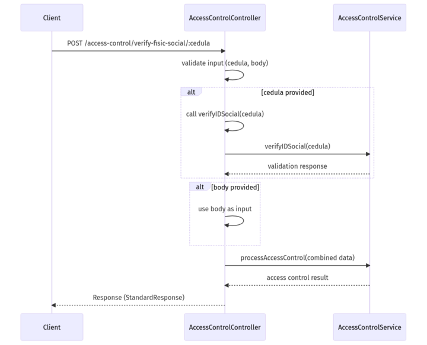

<style>
/* Justificar el texto en los encabezados */
h2, h3 {
    text-align: justify;
}

/* Justificar el texto en los párrafos */
p {
    text-align: justify;
}

img {
    display: block;
    margin: 0 auto;  /* Centra la imagen */
    width: 80%;  /* Ajusta el tamaño al 80% del contenedor */
    max-width: 600px;  /* Establece un ancho máximo para la imagen */
  }

  /* Estilo general para todas las tablas */
table {
    width: 100%;  /* Las tablas ocuparán todo el ancho del contenedor */
    border-collapse: collapse;  /* Colapsa los bordes para que no haya espacio entre celdas */
    table-layout: fixed;  /* Establece que todas las celdas tengan el mismo ancho */
}

/* Estilo para las celdas de la tabla */
th, td {
    padding: 8px;
    text-align: left;
    border: 1px solid #ddd;  /* Bordes suaves alrededor de cada celda */
    overflow: hidden;  /* Para evitar que el texto se desborde de las celdas */
    word-wrap: break-word;  /* Hace que el texto largo se ajuste a la celda */
}
th, td {
    width: 25%;  /* Ajusta este porcentaje según el número de columnas */
}

/* Estilo para las tablas en pantallas pequeñas */
@media (max-width: 768px) {
    table {
        display: block;  /* Convierte la tabla en un bloque deslizante */
        overflow-x: auto;  /* Permite que la tabla se deslice horizontalmente */
        white-space: nowrap;  /* Evita que el texto se ajuste */
    }
}

</style>

# Functional Requirements Document

## 1. General Project Information

| Project Name                  | Interface Design in the Middleware for PBCU Applications Integration         |
|-------------------------------|------------------------------------------------------------------------------|
| Sprint                        | Sprint # 4                                                                   |
| Assigned Team                 | Team J                                                                       |
| Sprint Start Date             | 1 November of 2024                                                           |
| Delivery Date                 | 15 November of 2024                                                          |

## 2. Objective

The objective of the project is to develop Middleware that enables integration between the TOS (OTM) system and Access Control for validating personnel access to port facilities. The system will verify whether individuals have authorized access based on criteria such as enrollment, active social security status, and the absence of sanctions or restrictions. It will also include the capability to process data extracted from emails for access validation.

## 3. Sprint Scope

The sprint focuses on developing Middleware to serve as an intermediary between the TOS (OTM) and the Access Control system for managing personnel access validation to port facilities. This includes receiving validation requests from the TOS (OTM), verifying enrollment, social security status, and the absence of sanctions in Access Control, as well as processing data extracted from emails. The system must ensure quick responses, robust error handling, and compliance with required security and availability standards.

## 4. Functional Requirements
### 4.1 General Description

- **RF-01:** The Middleware system must receive a person's information sent by the TOS (OTM) and forward it to Access Control for access validation.
- **RF-02:** The Middleware must verify with Access Control whether the person is enrolled, has active social security, and is free of restrictions or sanctions.
- **RF-03:** The Middleware must process emails to extract validation information and send it to Access Control.
- **RF-04:** The Middleware must properly handle authorization or denial codes and return a response to the TOS (OTM).
- **RF-05:** The system must include robust error handling for communication failures with Access Control.

### 4.2 Use Cases

#### Use Case 1: Validate Access from TOS (OTM)

- **Actor:** TOS (OTM) System
- **Preconditions:**
  - The TOS (OTM) system must be operational.
  - The Middleware must have access to the Access Control API.
- **Main Flow:**
  1. The TOS (OTM) sends the person's information (Identification) to the Middleware.
  2. The Middleware receives and processes the information.
  3. The Middleware sends the validation request to Access Control.
  4. Access Control returns an authorization or denial code.
  5. The Middleware returns the response to the TOS (OTM).
- **Postconditions:** The system returns a code indicating whether the person is authorized or denied.

#### Use Case 2: Validate Social and Physical Security

- **Actor:** Middleware (MDW)
- **Preconditions:** The Middleware must be connected to the Access Control system.
- **Main Flow:**
  1. The Middleware receives a request to validate a person.
  2. It queries Access Control for the person's social and physical security status.
  3. If the person is enrolled and meets the requirements, access is authorized.
  4. If issues are found, a code is returned with the specific reason.
- **Postconditions:** Access is either authorized or denied based on the validations performed.

#### Use Case 3: Extract Data from Emails for Validation

- **Actor:** Middleware (MDW)
- **Preconditions:**
  - Access to the Access Control API.
  - Configuration to receive emails.
- **Main Flow:**
  1. The Middleware receives an email.
  2. It extracts relevant data (e.g., Identification, security details).
  3. Sends the data to Access Control for validation.
  4. Receives the response and takes the appropriate action.
- **Postconditions:** The person is either authorized or denied based on the processed information.

## 5. Validations Requested by the Client

#### V-01: Validate that the person is enrolled in Access Control
 - **Description:** The system must verify if the person is registered in Access Control before granting access.
 - **Acceptance Criteria:** If the person is not enrolled, a denial code is returned.

#### V-02: Validate Active Social Security (EPS, ARL)
 - **Description:** The Middleware must ensure that the person's social security is active before granting access.
 - **Acceptance Criteria:** If social security is inactive, a specific error code must be returned.

#### V-03: Verification of Blockages and Sanctions
 - **Description:** Before granting access, the system must verify that the person does not have any active blockages or sanctions.
 - **Acceptance Criteria:** If sanctions are detected, a code indicating the reason for denial must be returned.

## 6. Assumptions and Dependencies

- The TOS (OTM) system will provide access to the necessary endpoints and documentation for integration.
- The proper functioning of the Access Control system is crucial for access validation.
- The client will provide access to a testing environment for the Access Control system.

## 7. Sequence Diagrams
### 

## 8. Service Data

```json
Request
{
   "cedula": "2"
}
```
```json
Response
{
   "statusResponse": "Ok",
   "code": 200,
   "validationStatus": "Ok",
   "description": "Sucessfull, the person is able to access."
}

```
## 9. Unit Tests
### 9.1	General Configuration
### 
### 9.2	getHealth
### 
### 9.3	verifyIDSocial
### 
### 9.4	processAccessControl
### 
### 

## 10. Annexes

#### Request

| No   |   Field  |Type | Size/Format | Domain |
|---------|------------|----------|-----------------|------------|
| 1       | *NIT    | Number   | 50              |            |

#### Responses

| No      | Field             | Type    |   Size/Format   | Domain              |
|---------|--------------------|----------|-----------------|-------------------------|
| 1       | *statusResponse     | String   | 5               | True, false             |
| 2       | *code              | Number   | 2               |                         |
| 3       | *validationStatus   | String   | 5               |                         |
| 4       | *description        | String   | 250             |                         |
