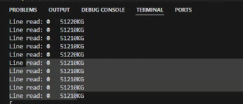

<style>
/* Justificar el texto en los encabezados */
h2, h3 {
    text-align: justify;
}

/* Justificar el texto en los párrafos */
p {
    text-align: justify;
}

img {
    display: block;
    margin: 0 auto;  /* Centra la imagen */
    width: 80%;  /* Ajusta el tamaño al 80% del contenedor */
    max-width: 600px;  /* Establece un ancho máximo para la imagen */
  }

  /* Estilo general para todas las tablas */
table {
    width: 100%;  /* Las tablas ocuparán todo el ancho del contenedor */
    border-collapse: collapse;  /* Colapsa los bordes para que no haya espacio entre celdas */
    table-layout: fixed;  /* Establece que todas las celdas tengan el mismo ancho */
}

/* Estilo para las celdas de la tabla */
th, td {
    padding: 8px;
    text-align: left;
    border: 1px solid #ddd;  /* Bordes suaves alrededor de cada celda */
    overflow: hidden;  /* Para evitar que el texto se desborde de las celdas */
    word-wrap: break-word;  /* Hace que el texto largo se ajuste a la celda */
}
th, td {
    width: 20%;  /* Ajusta este porcentaje según el número de columnas */
}
</style>

# Functional Requirements Document

## 1. General Project Information

| Project Name                  | Interface Design in the Middleware for PBCU Applications Integration         |
|-------------------------------|------------------------------------------------------------------------------|
| Sprint                        | Sprint # 2                                                                   |
| Assigned Team                 | Team G                                                                       |
| Sprint Start Date             | 22 October of 2024                                                           |
| Delivery Date                 | 31 October of 2024                                                           |

## 2. Objective

Integrate the Middleware with a weighing system and the TOS (OTM) system, enabling the capture of a vehicle's weight and associating it with the driver's ID. This information will then be sent to the TOS for use in logistical processes.

## 3. Sprint Scope

The Sprint scope covers the integration of the Middleware with a weighing system and the TOS (OTM) system to capture the driver's ID scanned at the scale, associate it with the vehicle's weight, and send this data, along with the license plate and container information, to the TOS for use in logistical processes. Data validations will be included to ensure accuracy before transmission. The scope does not include any modifications to the scale hardware or the TOS systems, focusing solely on the integration and management of the captured information.

## 4. Functional Requirements
### 4.1 General Description

- **RF-01:** The Middleware must allow the capture of the driver's ID from a barcode reader at the scale.
- **RF-02:** The Middleware must receive the vehicle's weight from the scale and associate it with the driver's ID.
- **RF-03:** The Middleware must query the TOS system to retrieve the vehicle's license plate and container associated with the driver's ID.
- **RF-04:** The Middleware must send the driver's ID, vehicle license plate, container, weight, date, and time to the TOS (OTM) system.
- **RF-05:** The Middleware must handle transmission errors and retry failed queries, notifying the originating system of the errors.

### 4.2 Use Cases

#### Use Case 1: Capture the Driver's ID and Associate it with the Vehicle's Weight

- **Actor:** Middleware, Scale
- **Preconditions:** The ID reader is operational and connected to the Middleware.
- **Main Flow:**
  1. The driver scans their ID at the barcode reader on the scale.
  2. The Middleware receives the ID and requests the vehicle's weight.
  3. The Middleware associates the ID with the vehicle's weight.
- **Postconditions:** The driver's ID and the vehicle's weight are correctly associated and stored in the system.

#### Use Case 2: Query the License Plate and Container Associated with the Driver's ID

- **Actor:** Middleware, TOS (OTM)
- **Preconditions:** The Middleware has captured the driver's ID.
- **Main Flow:**
  1. The Middleware invokes the "Vehicle and Container Query" service in the TOS, sending the driver's ID.
  2. The TOS returns the vehicle's license plate and the container associated with that ID.
- **Postconditions:** The Middleware successfully retrieves the vehicle's license plate and container.

#### Use Case 3: Send the Data to the TOS System

- **Actor:** Middleware, TOS (OTM)
- **Preconditions:** The Middleware has associated the driver's ID with the vehicle's weight and queried the license plate and container in the TOS.
- **Main Flow:**
  1. The Middleware sends the driver's ID, vehicle license plate, container, weight, date, and time to the TOS system.
- **Postconditions:** The TOS successfully receives and stores the sent data.

#### Use Case 4: Error Handling in Communication with the TOS

- **Actor:** Middleware, TOS (OTM)
- **Preconditions:** The Middleware attempts to send the weighing information to the TOS.
- **Main Flow:**
  1. The Middleware detects an error when sending the data to the TOS.
  2. The Middleware retries the operation a configurable number of times.
  3. If the operation continues to fail, the Middleware reports the error to the originating system.
- **Postconditions:** Errors are handled appropriately, and unsent data is reported for subsequent review.

## 5. Validations Requested by the Client

#### V-01: ID Validation
  - **Description:** The Middleware must validate that the captured ID follows the correct format.
  - **Acceptance Criteria:** The ID must consist of a valid number of 8 to 10 digits.

#### V-02: Vehicle Weight Validation
  - **Description:** The captured weight must be within an allowed range.
  - **Acceptance Criteria:** The weight must be between 1,000 and 80,000 kilograms.

#### V-03: Data Validation Before Sending
  - **Description:** Before sending the information to the TOS, the Middleware must validate that the ID, license plate, container, and weight are complete and correct.
  - **Acceptance Criteria:** All data must be complete and meet the format required by the TOS.

## 6. Assumptions and Dependencies

- The ID reader and the scale must be properly installed and functioning.
- The "Vehicle and Container Query" service from the TOS must be available and tested for integration.
- The testing environment for the TOS and the scale must be configured and accessible for integration testing.

## 7. Sequence Diagrams

### Sequence Diagrams
- Vehicle weight capture
### 

## 8. Service Data

### 8.1 Capture Vehicle Weights
Request and Response

```json
Request
{
   "idBascula": "2",
   "idDriver": 11115248569,
   "dateTime": "20240718103625",
   "weight": "25000"
}
```

```json
Responses
{
  "statusResponse": "Ok",
   "code": 200,
   "description": "Sucessfull"
}

```
## 9. Unit Tests

### A. Datos ficticios Bascula
### 

### B. Pruebas entorno Frontend
### 
### 
Scale Weights Obtained
### 
### 
### C. Pruebas Swagger – GetScaleById
### 
Responses GetScaleById
### 

## 10. Annexes

### 10.1 Capture Vehicle Weights

#### Requests

| No. | Field       | Type     | Size/Format | Domain |
|-----|-------------|----------|-------------|--------|
| 1   | idBascula   | Number   | 10          | -      |
| 2   | idDriver    | Number   | 20          | -      |
| 3   | dateTime    | DateTime | 20          | -      |
| 4   | weight      | Number   | 6           | Kg     |

#### Responses

| No. | Field           | Type    | Size/Format | Domain          |
|-----|-----------------|---------|-------------|-----------------|
| 1   | statusResponse  | String  | 5           | True, false     |
| 2   | code            | Number  | 2           | -               |
| 3   | description     | String  | 250         | Status Message  |
