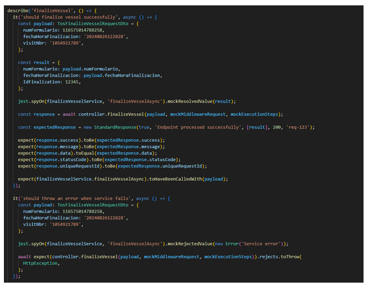

<style>
/* Justificar el texto en los encabezados */
h2, h3 {
    text-align: justify;
}

/* Justificar el texto en los párrafos */
p {
    text-align: justify;
}

img {
    display: block;
    margin: 0 auto;  /* Centra la imagen */
    width: 80%;  /* Ajusta el tamaño al 80% del contenedor */
    max-width: 600px;  /* Establece un ancho máximo para la imagen */
  }

  /* Estilo general para todas las tablas */
table {
    width: 100%;  /* Las tablas ocuparán todo el ancho del contenedor */
    border-collapse: collapse;  /* Colapsa los bordes para que no haya espacio entre celdas */
    table-layout: fixed;  /* Establece que todas las celdas tengan el mismo ancho */
}

/* Estilo para las celdas de la tabla */
th, td {
    padding: 8px;
    text-align: left;
    border: 1px solid #ddd;  /* Bordes suaves alrededor de cada celda */
    overflow: hidden;  /* Para evitar que el texto se desborde de las celdas */
    word-wrap: break-word;  /* Hace que el texto largo se ajuste a la celda */
}
th, td {
    width: 20%;  /* Ajusta este porcentaje según el número de columnas */
}
</style>


# Functional Requirements Document

## 1. General Project Information

| Project Name                  | Interface Design in the Middleware for PBCU Applications Integration         |
|-------------------------------|------------------------------------------------------------------------------|
| Sprint                        | Sprint # 2                                                                   |
| Assigned Team                 | Team G                                                                       |
| Sprint Start Date             | 23 September of 2024                                                         |
| Delivery Date                 | 11 October of 2024                                                           |

## 2. Objective
Develop a Middleware that enables authentication and communication between the TOS (Terminal Operating System) and DIAN services, facilitating the management of imports. The Middleware must manage authentication, consultation, and the sending of documents (manifests, BLs, ARIM, among others) and process the responses to send them to the TOS in an automated and efficient manner.

## 3. Sprint Scope

The sprint scope includes the integration and automation of processes with DIAN, ensuring authentication for obtaining and renewing tokens, which allows secure and continuous access to the entity's services. It includes the automated processing of requests related to the completion of vessels, consultation of manifests and BLs, and the reporting of forms, ensuring efficient document and operational management. Additionally, it encompasses sending responses from DIAN to the TOS system, complying with the required formats, as well as the automated management of the consultation and sending of reception and dispatch forms, optimizing information exchange and facilitating logistical processes. Finally, it addresses the handling of detailed reports and tags related to imports, consolidating operational information.

## 4. Functional Requirements

### 4.1 General Description

**DIAN – Authentication Scheme for Interoperability with External Systems**

  - **FR-01:** The Middleware must manage authentication with DIAN by obtaining a limited-use token.
  - **FR-02:** Validate whether the obtained token is valid or if it is necessary to request a new one before executing any service.
  - **FR-03:** Store the authentication token for use in future services that interact with DIAN.
  - **FR-04:** The Middleware must allow the completion of vessels in DIAN upon receiving a request from the TOS (OTM).
  - **FR-05:** The Middleware must consume the DIAN service to consult the completed vessel manifest.
  - **FR-06:** The Middleware must obtain and store the lithography details and DIAN ID of each BL associated with the manifest.
  - **FR-07:** The Middleware must consult the BLs associated with a vessel after consulting the manifest in DIAN.
  - **FR-08:** The Middleware must send the manifest and the details of each BL to the TOS in the defined structure.
  - **FR-09:** The Middleware must receive the tag and detail report from the TOS and send them to DIAN.
  - **FR-10:** The Middleware must consume the Detail Report service in DIAN to report the information received from the TOS.
  - **FR-11:** The Middleware must receive the request to "Receive tag and detail report" from the TOS and process it with DIAN.
  - **FR-12:** The Middleware must consume the Report Tag service in DIAN to inform about containers that have been imported and are in the yard.
  - **FR-13:** A job must be created that runs every 3 hours for 48 hours or until a successful response is received from DIAN to consult and send the shipping and reception forms.
  - **FR-14:** The Middleware must consult the shipping form in DIAN after receiving the BL from the form orchestrator.
  - **FR-15:** After a request for the withdrawal of import cargo in the TOS, the Middleware must consult the import declaration in DIAN.
  - **FR-16:** Upon confirming the creation of a delivery appointment for import cargo in the TOS, the Middleware must send the ARIM to DIAN.

### 4.2 Use Cases

#### Use Case 1: Authentication Management with DIAN

- **Actor:** Middleware (MDW)
- **Preconditions:** The Middleware must have the authentication credentials for DIAN.
- **Main Flow:**
    1. The Middleware receives an authentication request.
    2. The status of the current token is verified:
      - If it is valid, the token is reused.
      - If it has expired, a new one is requested.
    3. The token is stored for future use.
    4. The token is returned to the requesting service.
- **Postconditions:** The Middleware has a valid token that can be used to consume DIAN services.

#### Use Case 2: Vessel Completion

- **Actor:** TOS (OTM)
- **Preconditions:** The Middleware must be authenticated with DIAN.
- **Main Flow:**
    1. The TOS sends a request to the Middleware to complete a vessel.
    2. The Middleware authenticates the request with DIAN using the valid token.
    3. The Middleware consumes the "Vessel Completion" service in DIAN.
    4. The response from DIAN is sent back to the TOS.
    5. The manifest is stored for future reference.
- **Postconditions:** The vessel is successfully completed in DIAN, and the response is sent to the TOS.

#### Use Case 3: Consult Manifest

- **Actor:** Middleware (MDW)
- **Preconditions:** The Middleware must have successfully authenticated with DIAN, the vessel must be completed, and the manifest must be available in DIAN.
- **Main Flow:**
    1. The Middleware developer invokes the authentication service with DIAN.
    2. Once authenticated, the authentication token is received.
    3. After the vessel completion, the Middleware consumes the DIAN service to consult the manifest.
    4. The system retrieves the lithography details and the DIAN ID of each BL (Bill of Lading) associated with the manifest.
    5. The Middleware successfully stores the lithography information and the DIAN ID of each BL.
- **Postconditions:** The information of the BLs is successfully obtained and stored.

#### Use Case 4: Consult BLs

- **Actor:** Middleware (MDW)
- **Preconditions:** The Middleware must have successfully authenticated with DIAN and obtained a list of BLs after consulting the manifest.
- **Main Flow:**
    1. The Middleware authenticates with DIAN using the valid token.
    2. The Middleware iterates through the list of BLs and consumes the "Bill of Lading Consultation" service for each BL.
    3. The Middleware stores the information obtained from each BL in an Excel file.
- **Postconditions:** The details of each BL are successfully obtained and stored in the Excel file.

#### Use Case 5: Sending Manifest and BL Information to TOS

- **Actor:** Middleware (MDW), TOS (OTM)
- **Preconditions:** The manifest number and the details of the associated BLs must have been obtained.
- **Main Flow:**
    1. The Middleware retrieves the manifest number (Form 1165) along with the details of all its stored BLs.
    2. The information is constructed in the structure defined in the Excel file.
    3. The information is sent to the TOS in the established format.
- **Postconditions:** The TOS successfully receives the information of the manifest and the BLs.

#### Use Case 6: Card Reception and Details Report

- **Actor:** Middleware (MDW), TOS (OTM), DIAN
- **Preconditions:** The Middleware must have previously sent the manifest and the BLs to the TOS.
- **Main Flow:**
  1. The Middleware receives a request from the TOS that includes the tag and detail report.
  2. The requests for the "Detail Report" and "Report Tag" services are constructed.
  3. The Middleware invokes the "Detail Report" and "Report Tag" services in DIAN.
  4. The response from DIAN is returned to the TOS.
- **Postconditions:** The tag and report are successfully sent to DIAN, and the TOS receives the responses from the services.

#### Use Case 7: Report Tag and Detail Report

- **Actor:** Middleware (MDW), TOS (OTM), DIAN
- **Preconditions:** A request must be received from the TOS to report the tag and detail report.
- **Main Flow:**
 1. The Middleware receives the "Receive tag and detail report" request from the TOS.
 2. It authenticates with DIAN using the authentication service.
 3. The information from the TOS request is combined with the authentication.
 4. The Middleware consumes the "Detail Report" service in DIAN.
 5. The response from the service is returned to the TOS.
- **Postconditions:** The service is successfully consumed in DIAN, and the response is sent to the TOS.

#### Use Case 8: Report Tag for Containers in Yard

- **Actor:** Middleware (MDW), TOS (OTM), DIAN
- **Preconditions:** A request must be received from the TOS to report the tag and detail report.
- **Main Flow:**
 1. The Middleware receives the "Receive tag and detail report" request from the TOS and processes it with DIAN.
 2. It authenticates with DIAN using the authentication service.
 3. The information from the TOS request is combined with the authentication.
 4. The Middleware consumes the "Report Tag" service in DIAN to report the containers that have been imported and are in the yard.
 5. The response from the service is returned to the TOS.
- **Postconditions:** The tag and detail report are successfully sent to DIAN, and the TOS receives the responses from the services.

#### Use Case 9: Spreadsheet Orchestrator

- **Actor:** Middleware (MDW), DIAN, TOS (OTM)
- **Preconditions:** The process for querying and sending forms must be defined.
- **Main Flow:**
  1. A job is created that runs every 3 hours for a period of 48 hours, or until a successful response is received from DIAN.
  2. The Middleware authenticates with DIAN.
  3. The list of BLs from the recently created manifest is iterated through.
  4. The request body is constructed with the found BLs.
  5. The "Consult Shipping Form" service in DIAN is consumed for each BL.
  6. When the response is successful, the "Send Reception Form" service is consumed.
  7. The forms are stored and sent to the TOS.
- **Postconditions:** The forms are successfully sent to DIAN and the TOS within the established timeframe.

#### Use Case 10: Consult Shipping Form

- **Actor:** Middleware (MDW), DIAN
- **Preconditions:** The Middleware must have received the BL from the form orchestrator.
- **Main Flow:**
  1. The Middleware queries the shipping form in DIAN after receiving the BL.
  2. It authenticates with DIAN.
  3. The DIAN service to consult the shipping form is consumed.
  4. The response is returned to the form orchestrator.
- **Postconditions:** La planilla de envío es consultada correctamente y la respuesta se gestiona adecuadamente.

#### Use Case 11: Consult Import Declaration

- **Actor:** Middleware (MDW), DIAN
- **Preconditions:** A request for the withdrawal of imported cargo is received from the TOS.
- **Main Flow:**
  1. The Middleware receives the request for the withdrawal of imported cargo from the TOS.
  2. The Middleware authenticates with DIAN.
  3. The "Consult Import Declaration" service is consumed by sending the `numDeclaracion`.
  4. The response from DIAN is returned to the TOS.
- **Postconditions:** The import declaration is successfully queried, and the response is sent to the TOS.

#### Use Case 12: Sending ARIM to DIAN

- **Actor:** Middleware (MDW), TOS (OTM), DIAN
- **Preconditions:** The creation of a delivery appointment for imported cargo in the TOS is confirmed.
- **Main Flow:**
  1. The Middleware receives the delivery appointment confirmation from the TOS.
  2. It authenticates with DIAN.
  3. The ARIM request is constructed according to DIAN's policies.
  4. The "Send ARIM" service in DIAN is consumed.
  5. The response is returned to the TOS in the established format.
- **Postconditions:** The ARIM is successfully sent to DIAN, and the response is returned to the TOS in the appropriate format.

## 5. Client-Requested Validations

#### V-01: Authentication Token Validation
- **Description:** Verify the validity of the authentication token before making any requests to the DIAN.
- **Acceptance Criteria:**
  - If the token is valid, it must be used.
  - If the token has expired, a new one must be requested automatically.

#### V-02: Validation of Vessel Data
- **Description:** Verify that the vessel data provided by the TOS is valid and that the vessel exists in the DIAN database.
- **Acceptance Criteria:**
  - The vessel must be registered and active in the DIAN system.
  - A clear error message must be returned if the vessel is not valid.

#### V-03: Validation of Manifest Inquiry in DIAN
- **Description:** Ensure that the Middleware correctly queries the vessel's manifest in the DIAN system upon completing the operation.
- **Acceptance Criteria:**
  - The DIAN response must contain the complete manifest with all associated BLs.
  - If the vessel does not exist or does not have an associated manifest, an error must be returned to the TOS.

#### V-04: Validation of BL Existence
- **Description:** Validate that the queried manifest has at least one associated BL and that all BLs are valid.
- **Acceptance Criteria:**
  - The response must contain at least one BL to be considered valid.
  - If no BLs are found, an error must be returned to the TOS.

#### V-05: Manifest Format Validation
- **Description:** Ensure that the manifest information meets the expected format and contains all required fields.
- **Acceptance Criteria:**
  - The existence and format of all expected fields in the manifest must be validated.
  - If information is missing or there is an incorrect format, an error must be returned to the TOS.

#### V-06: Validation of Tarja Data
- **Description:** Verify that the tarja and detail report received from the TOS contain complete information and are in the correct format.
- **Acceptance Criteria:**
  - The existence and format of all expected fields in the tarja must be validated.
  - If information is missing or there is an incorrect format, an error must be returned to the TOS.

#### V-07: Validation of Report Information
- **Description:** Verify that the information for the tarja report and detail report is complete and complies with DIAN policies.
- **Acceptance Criteria:**
  - The information must meet the format and required fields specified by DIAN.
  - An error must be returned if the information is incomplete or incorrect.

#### V-08: Container Validation
- **Description:** Verify that the containers announced for the report are registered and in a valid state to be reported.
- **Acceptance Criteria:**
  - The containers must exist in the DIAN database.
  - An error must be returned if any of the containers are not valid.

#### V-09: Job Configuration Validation
- **Description:** Ensure that the job for querying and sending forms is configured correctly.
- **Acceptance Criteria:**
  - The job must run at the defined time intervals and handle responses correctly.
  - Any errors during the job execution must be logged.

#### V-10: Validation of Form Inquiry
- **Description:** Verify that the inquiry of the shipment form returns the expected information.
- **Acceptance Criteria:**
  - The response must contain the shipment form in the expected format.
  - In case of an error during the inquiry, the error must be handled, and a clear message must be returned to the TOS.

#### V-11: Validation of Import Declaration
- **Description:** Verify that the queried import declaration contains the necessary information for cargo withdrawal.
- **Acceptance Criteria:**
  - The response must contain all required information for withdrawal.
  - If the declaration is not valid, a clear error must be returned to the TOS.

#### V-12: Validation of ARIM Structure
- **Description:** Verify that the ARIM sent to the DIAN complies with the required policies and structure.
- **Acceptance Criteria:**
  - The ARIM must contain all required fields and be in the correct format.
  - If information is missing or there is an incorrect format, an error must be returned to the TOS.

## 6.	Assumptions and Dependencies

### Assumptions:
- **Availability of DIAN Services:** It is assumed that DIAN services will be continuously available.
- **Access to Credentials:** Valid credentials will be available to access DIAN services.
- **Collaboration with TOS (OTM):** There will be smooth communication with the TOS team for integration.
- **Defined Data Structure:** The data formats (manifests, BLs, etc.) are already agreed upon.
- **Available Testing Environment:** A stable testing environment is guaranteed.
- **Version Compatibility:** The Middleware will be compatible with the current versions of DIAN and TOS.
- **Functional Automation:** The query job will execute correctly at the established intervals.

### Dependencies:
- **DIAN Services:** The Middleware depends on the availability of DIAN services.
- **Integration with TOS:** Proper integration with the TOS system is crucial.
- **Security:** The use of valid certificates and credentials for authentication is necessary.
- **DIAN Responses:** The query job depends on timely responses from DIAN.
- **DIAN Regulations:** Any regulatory changes from DIAN may require adjustments in the Middleware.
- **Integration Testing:** Necessary to ensure the functionality of the complete system.

## 7. Sequence Diagrams

### Import Declaration

### 

### Shipping Template

### 

## 8. Service Data

### 8.1 Finalize Vessel
### Requests and Response

```json
Request
{
   "numFormulario": "1234567898765432",
   "fechaHoraFinalizacion": "20240219103625",
   "visitNbr": "1234565432"
}
Response sucessfull
{
	"statusResponse":"Ok",
	"code":200,
	"description":{
   "numFormulario": "1234567898765432",
   "fechaHoraFinalizacion": "20240219103625",
   "IdFinalization":"9876543212345678"
}
}
Response Fail
{
	"statusResponse":"Fail",
	"code":02,
	"description":"Whatever error"
}
```
### 8.2 Send Manifest and BL details
### Requests and Response

```json
Request
{
   "numFormulario": 12345,
   "billOfLoadings": [
      {
         "id": 116576539876,
         "number": 6789,
         "date": "2024-07-23T15:30:00Z",
         "idType": "Tipo de identificación",
         "idName": "Nombre del identificador",
         "chargeId": "ID del cargo",
         "chargeName": "Nombre del cargo",
         "chargeDispositionCode": "Código de disposición del cargo",
         "dianChargeDispositionName": "Nombre de la disposición del cargo en la DIAN",
         "weight": "Peso del objeto"
      }
   ]
}

Response suceesfull
{
	"statusResponse":"Ok",
	"code":200,
	"description":"sucessfull"
}
Response Fail
{
	"statusResponse":"Fail",
	"code":02,
	"description":"Whatever error"
}
```
### 8.3 Submit details report
### Requests and

```json
Request
{
   "DinformeDetallesCargarecibida": {
      "cargoType": "CC",
      "numManifiesto": 123456,
      "numFormatoAnterior": 654321,
      "numeroRecaladaTerminal": "786543267",
      "nombreMotonave": "CMA Vessel Name",
      "linea": "Line Cod",
      "podReportadoNaviero": "cod PBCU",
      "unidadesCargaRecibida": [
         {
            "CodTipoDocumentoViaje": 1,
            "numDocumentoTransporte": 11667654325678,
            "fechaDocumentoTransporte": "20240219103625",
            "codTipoCarga": "02",
            "pesoBrutoKg": 10056,
            "cantidadBultos": "543",
            "agenteCargaConsignatario": "Importer name",
            "unidades": [
               {
                  "codEstadoContenedor": 1,
                  "numContenedor": "CMAU7654353",
                  "tamanoContenedor": "40",
                  "tipoContenedor": "Reefer",
                  "sello1": "hjsahy656",
                  "codigoCargaPeligrosa": "7854",
                  "polReportadoNaviero": "port code exporter",
                  "fpodReportadoNaviero": "cabotaje"
               }
            ]
         }
      ],
      "contenedoresVacios": [
         {
            "codEstadoContenedor": 1,
            "numContenedor": "CMAU7659074"
         }
      ]
   }
}
Response
{
   "statusResponse": "Ok",
   "code": 200,
   "description": {
      "numFormulario": "1234567898765432",
      "fechaTransaccion": "20240219103625",
      "numInformeDetallesCargaRecibida": "9876543212345678"
   }
}
```
### 8.4	Import declaration query
### Request and Response

```json
Request
{
   Endponit\numDeclaracion
}
Response
{
	"statusResponse":"Ok",
	"code":200,
	"description":
	{
	  "numFormulario": "",
	  "numIdentificacionImportador": "",
	  "dvImportador": null,
	  "nombresImportador": "",
	  "numIdentificacionDeclarante": "",
	  "dvDeclarante": null,
	  "nombresDeclarante": "",
	  "tipoDeclaracion": "",
	  "numFormularioanterior": "",
	  "fechaFormularioAnterior": "",
	  "codLugarIngreso": "",
	  "codDeposito": null,
	  "Manifiesto": "",
	  "fechaLlegada": "",
	  "docTransporte": "",
	  "numFactura": "",
	  "fechaFactura": "",
	  "codModalidad": "",
	  "tipoImportacion": "",
	  "pesoBruto": null,
	  "pesoNeto": null,
	  "numBultos": null,
	  "valPagoTotal": null,
	  "numAceptacionDecla": "",
	  "fechaAceptacionDecla": "",
	  "numLevante": "",
	  "fecLevante": "",
	  "codEstado": "",
	  "resultadoSelectividad": ""
	}
}
```
### 8.5	SendArimImport declaration
### Request and Response

```json

Request
{
  "cargoType": "",
  "numeroRetiroCarga": "",
  "numeroManifiestoCarga": null,
  "numeroDocumentoTransporte": "",
  "estadoAduaneroCarga": "",
  "depositoDestino": "",
  "cantidadBultos": null,
  "Peso Carga": null,
  "empresaSolicitaRetiro": "",
  "numeroContenedor": "",
  "tamanoContenedor": "",
  "tipoContenedor": "",
  "sello1": ""
}

Response
{
	"statusResponse":"Ok",
	"code":200,
	"description":{
		"fechaHora": "20241201115005",
		"respuesta": "Recibido en Fecha."
	}
}
```
### 8.6 Save delivery and reception forms
### Request and Response

```json
Request
{
   "bl": "String",
   "deliveryFormNbr": 123456,
   "deliveryFormDate": "2024-07-24T12:00:00Z",
   "receptionFormNbr": 789012,
   "receptionFormDate": "2024-07-25T08:30:00Z"
}
Response
{
   "statusResponse": "Ok",
   "code": 200,
   "description": "sucessfull"
}
```
## 9. Unit Testing

### A. Test Block Configuration
A test block is defined, and variables for the controller and the service being used are declared.
### 
### B. Mocks
A `mockExecutionSteps` object is created to simulate the behavior of the execution steps that will be used during testing. Additionally, a `mockMiddlewareRequest` object is defined to simulate a request that will be passed to the controller, allowing for testing how the controller handles requests without making an actual call.
### 
### C. Initialization Before Each Test
A test module is created that includes the controller and the mocked services. The `beforeEach` method runs before each test to set up the environment.
### 
### D. Method Tests
The test scenario is defined for the corresponding methods; in this case, the `finalizeVessel` method is tested for success. A payload is created and passed to the method, simulating the service response, and the response is compared to ensure accuracy.
### 
### E. Error Handling
An error is simulated in detail, and it is ensured that the controller properly handles the error response.
### 

## 10. Annexes

### 10.1 Finalize Vessel

#### Requests

| No | Field               | Type   | Size/Format       | Domain                     |
|----|----------------------|--------|-------------------|----------------------------|
| 1  | numFormulario       | Number | 16               |                            |
| 2  | fechaHoraFinalizacion | String | 14/yyyymmddHHmmss | Ej: 20240219103625         |
| 3  | visitNbr            | Is the IdVessel in the TOS | |                            |

#### Responses

| No | Field               | Type   | Size/Format       | Domain                     |
|----|----------------------|--------|-------------------|----------------------------|
| 1  | StatusResponse      | String | 5                 | True, false                |
| 2  | code                | Number | 3                 |                            |
| 3  | description         | String | 5000              |                            |
| 4  | numFormulario       | Number | 16                |                            |
| 5  | fechaHoraFinalizacion | String | yyyy/mm/dd HH:mm:ss |                            |
| 6  | IdFinalization      | Number | 18                |                            |

---

### 10.2 Send Manifest and BL Details

#### Requests

| No | Field                         | Type     | Size/Format | Domain |
|----|--------------------------------|----------|-------------|--------|
| 1  | numFormulario                 | Numeric  | 20          |        |
| 2  | id                            | Numeric  | 20          |        |
| 3  | number                        | Numeric  | 20          |        |
| 4  | date                          | DateTime | 20          |        |
| 5  | idType                        | String   | 2           |        |
| 6  | idName                        | String   | 20          |        |
| 7  | chargeId                      | String   | 2           |        |
| 8  | chargeName                    | String   | 20          |        |
| 9  | chargeDipositionCode          | String   | 2           |        |
| 10 | Dian Charge Disposition Name  | String   | 20          |        |
| 11 | weight                        | String   | 10          |        |

#### Responses

| No | Field           | Type   | Size/Format | Domain     |
|----|------------------|--------|-------------|------------|
| 1  | statusResponse  | String | 5           | True, false |
| 2  | code            | Number | 2           |            |
| 3  | description     | String | 5000        |            |

---

### 10.3 Submit Details Report

#### Requests

| No | Field                        | Type     | Size/Format | Domain           |
|----|-------------------------------|----------|-------------|------------------|
| 1  | numManifiesto                | Numeric  | 20          |                  |
| 2  | numFormatoAnterior           | Numeric  | 2           |                  |
| 3  | unidadesCargaRecibida        | Array    |             |                  |
| 4  | CodTipoDocumentoViaje        | String   | 2           |                  |
| 5  | numDocumentoTransporte       | Numeric  | 14          |                  |
| 6  | fechaDocumentoTransporte     | String   | 16          |                  |
| 7  | codTipoCarga                 | String   | 2           |                  |
| 8  | pesoBrutoKg                  | Number   | 15          |                  |
| 9  | unidades                     | Array    |             |                  |
| 10 | contenedoresVacios           | Array    |             |                  |
| 11 | numContenedor                | String   | 20          |                  |
| 12 | codEstadoContenedor          | Numeric  | 2           |                  |
| 13 | numeroRecaladaTerminal       | String   | 15          |                  |
| 14 | nombreMotonave               | String   | 50          |                  |
| 15 | agenteCargaConsignatario     | String   | 50          |                  |
| 16 | cantidadBultos               | Number   | 10          |                  |
| 17 | linea                        | String   | 6           |                  |
| 18 | tamanoContenedor             | String   | 10          |                  |
| 19 | tipoContenedor               | String   | 20          |                  |
| 20 | sello1                       | String   | 15          |                  |
| 21 | codigoCargaPeligrosa         | String   | 4           |                  |
| 22 | polReportadoNaviero          | String   | 6           |                  |
| 23 | podReportadoNaviero          | String   | 6           |                  |
| 24 | fpodReportadoNaviero         | String   | 6           |                  |
| 25 | cargoType                    | String   | 2           | CC, CG, CS, CR   |

#### Responses

| No | Field                         | Type     | Size/Format | Domain        |
|----|-------------------------------|----------|-------------|---------------|
| 1  | statusResponse                | String   | 5           | True, false   |
| 2  | code                          | Number   | 2           |               |
| 3  | description                   | String   | 5000        |               |
| 4  | numInformeDetallesCargaRecibida | Numeric  | 20          |               |
| 5  | fechaTransaccion              | String   | 16          |               |

### 10.4 Import Declaration Query

#### Requests

| No | Field                        | Type   | Size/Format | Domain         |
|----|------------------------------|--------|-------------|----------------|
| 1  | numDeclaracion               | Number | 15          | GET / REST     |

#### Responses

| No | Field                          | Type     | Size/Format | Domain        |
|----|--------------------------------|----------|-------------|---------------|
| 1  | statusResponse                 | String   | 5           | True, false   |
| 2  | Code                           | Number   | 3           |               |
| 3  | description                    | String   | 5000        |               |
| 4  | numFormulario                  | String   | 16          |               |
| 5  | numIdentificacionImportador    | String   | 15          |               |
| 6  | dvImportador                   | Numeric  | 1           |               |
| 7  | nombresImportador              | String   | 60          |               |
| 8  | numIdentificacionDeclarante    | String   | 15          |               |
| 9  | dvDeclarante                   | Numeric  | 1           |               |
| 10 | nombresDeclarante              | String   | 60          |               |
| 11 | tipoDeclaracion                | String   | 12          |               |
| 12 | numFormularioanterior          | String   | 16          |               |
| 13 | fechaFormularioAnterior         | String   | 10          |               |
| 14 | codLugarIngreso                | String   | 3           |               |
| 15 | codDeposito                   | Numeric  | 10          |               |
| 16 | Manifiesto                     | String   | 15          |               |
| 17 | fechaLlegada                  | String   | 15          |               |
| 18 | docTransporte                  | String   | 30          |               |
| 19 | numFactura                     | String   | 20          |               |
| 20 | fechaFactura                   | String   | 20          |               |
| 21 | codModalidad                   | String   | 4           |               |
| 22 | tipoImportacion                | String   | 2           |               |
| 23 | pesoBruto                     | Numeric decimal | 16-2 |               |
| 24 | pesoNeto                      | Numeric decimal | 16-2 |               |
| 25 | numBultos                    | Numeric decimal | 12-2 |               |
| 26 | valPagoTotal                  | Numeric decimal | 16-2 |               |
| 27 | numAceptacionDecla            | String   | 16          |               |
| 28 | fechaAceptacionDecla          | String   | 14          |               |
| 29 | numLevante                    | String   | 16          |               |
| 30 | fecLevante                    | String   | 16          |               |
| 31 | codEstado                     | String   | 60          |               |
| 32 | resultadoSelectividad          | String   | 60          |               |

### 10.5 Send Arim

#### Requests

| No | Field                        | Type   | Size/Format | Domain         |
|----|------------------------------|--------|-------------|----------------|
| 1  | visitNbr                     | String |             | Is the IdVessel in the TOS |
| 2  | cargoType                    | String |             | CC, CG, CS, CR |
| 3  | numeroRetiroCarga            | String | 20          |                |
| 4  | numeroManifiestoCarga        | Numeric | 20         |                |
| 5  | numeroDocumentoTransporte     | String | 40          |                |
| 6  | estadoAduaneroCarga         | String | 50          | Nacionalizada, Con Planilla de Envío, En Tránsito |
| 7  | depositoDestino              | String | 40          |                |
| 8  | cantidadBultos               | Numeric | 10         |                |
| 9  | Peso Carga                   | Number decimal | 15    |                |
| 10 | empresaSolicitaRetiro        | String | 100         |                |
| 11 | numeroContenedor             | String | 15          |                |
| 12 | tamanoContenedor             | String | 10          |                |
| 13 | tipoContenedor               | String | 20          |                |
| 14 | sello1                       | String | 15          |                |

#### Responses

| No | Field                        | Type     | Size/Format | Domain        |
|----|------------------------------|----------|-------------|---------------|
| 1  | statusResponse               | String   | 5           | True, false   |
| 2  | code                         | Number   | 2           |               |
| 3  | description                  | String   | 5000        |               |
| 4  | respuesta                    | String   | 20          |               |
| 5  | fechaHora                    | String   | 16          |               |

### 10.6 Save Delivery and Reception Forms

#### Requests

| No | Field                         | Type   | Size/Format | Domain        |
|----|-------------------------------|--------|-------------|---------------|
| 1  | bl                            | String | 50          |               |
| 2  | deliveryFormNbr              | Numeric | 20          |               |
| 3  | deliveryFormDate             | DateTime | 20         |               |
| 4  | receptionFormNbr             | Numeric | 20          |               |
| 5  | receptionFormDate            | DateTime | 20         |               |

#### Responses

| No | Field                         | Type     | Size/Format | Domain        |
|----|-------------------------------|----------|-------------|---------------|
| 1  | statusResponse                | String   | 5           | True, false   |
| 2  | code                          | Number   | 2           |               |
| 3  | description                   | String   | 5000        |               |
