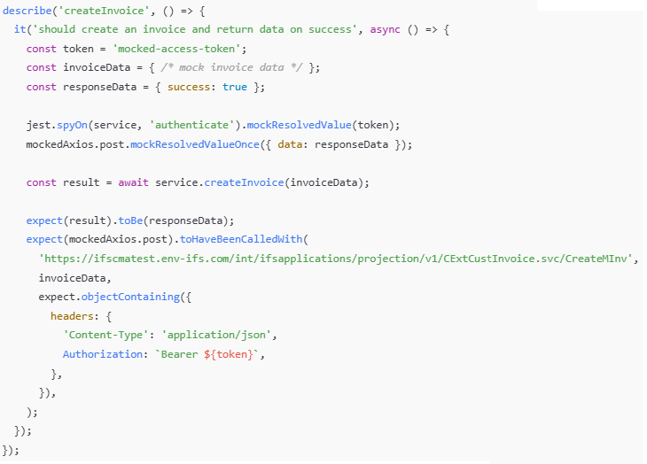
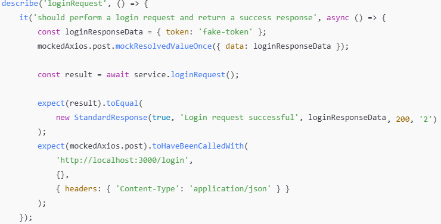
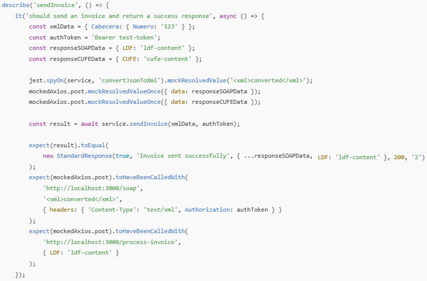

<style>
/* Justificar el texto en los encabezados */
h2, h3 {
    text-align: justify;
}

/* Justificar el texto en los párrafos */
p {
    text-align: justify;
}

img {
    display: block;
    margin: 0 auto;  /* Centra la imagen */
    width: 80%;  /* Ajusta el tamaño al 80% del contenedor */
    max-width: 600px;  /* Establece un ancho máximo para la imagen */
  }

  /* Estilo general para todas las tablas */
table {
    width: 100%;  /* Las tablas ocuparán todo el ancho del contenedor */
    border-collapse: collapse;  /* Colapsa los bordes para que no haya espacio entre celdas */
    table-layout: fixed;  /* Establece que todas las celdas tengan el mismo ancho */
}

/* Estilo para las celdas de la tabla */
th, td {
    padding: 8px;
    text-align: left;
    border: 1px solid #ddd;  /* Bordes suaves alrededor de cada celda */
    overflow: hidden;  /* Para evitar que el texto se desborde de las celdas */
    word-wrap: break-word;  /* Hace que el texto largo se ajuste a la celda */
}
th, td {
    width: 20%;  /* Ajusta este porcentaje según el número de columnas */
}
</style>

# Functional Requirements Document

## 1. General Project Information

| Project Name                  | Interface Design in the Middleware for PBCU Applications Integration         |
|-------------------------------|------------------------------------------------------------------------------|
| Sprint                        | Sprint # 2                                                                   |
| Assigned Team                 | Team G                                                                       |
| Sprint Start Date             | 23 September of 2024                                                         |
| Delivery Date                 | 11 October of 2024                                                           |

## 2. Objective

To integrate the Middleware system with TOS (OTM), the technology provider (Facture), the ERP, and the Payment Portal, in order to manage electronic invoicing, status reporting, and payment processing. The goal is to automate communication between these systems, ensuring that invoices, credit notes, and payments are processed and recorded accurately.

## 3. Sprint Scope

The Sprint scope includes implementing services in Middleware to handle the reception, validation, and transmission of invoices and credit notes from TOS, communication with the technology provider for authentication and processing with DIAN, and status notifications to the ERP and Payment Portal.

## 4. Functional Requirements

### 4.1 General Description

- **RF-01**: Reception and Processing of Invoices/Credit Notes from TOS (OTM) - Middleware must receive invoices or credit notes in JSON format from TOS, validate them, convert them to XML, and send them to the technology provider.
- **RF-02**: Authentication with the Technology Provider - Middleware must authenticate with the provider (Facture) to obtain a token and use it for invoicing transactions.
- **RF-03**: Sending Invoices/Credit Notes to the Technology Provider - Middleware must send invoices/credit notes to the technology provider for processing with DIAN and handle any errors or rejections.
- **RF-04**: Contingency Process - Middleware must activate a contingency process if DIAN does not respond within the expected time frame, generating contingency invoices.
- **RF-05**: Status Reporting to TOS (OTM) - Middleware must notify TOS of the final status of invoices/credit notes (accepted or rejected), including details such as CUFE and URL.
- **RF-06**: Status Reporting to ERP - Middleware must report the status of invoices/credit notes to the ERP for accounting, adapting the data to the required structure.
- **RF-07**: Status Reporting to Payment Portal - Middleware must send invoice information to the Payment Portal for viewing and payment.
- **RF-08**: Reporting Payments to TOS and ERP - Middleware must report the status of payments received from the Payment Portal to both TOS and ERP.

### 4.2 Use Cases

#### Use Case 1: Authentication with the Technology Provider
- **Actor**: Middleware
- **Preconditions**: Middleware must have the provider's credentials.
- **Main Flow**:
  1. Middleware sends an authentication request with the credentials.
  2. The provider returns an access token.
  3. Middleware stores the token for future use.
- **Postconditions**: Middleware is authenticated and can access the provider's services.

#### Use Case 2: Send Invoice or Credit Note
- **Actor**: Middleware
- **Preconditions**: Middleware must be authenticated and have the invoice ready for submission.
- **Main Flow**:
  1. Middleware validates the invoice format against the required schema.
  2. Middleware sends the invoice to the technology provider.
  3. Middleware waits for the provider's response.
- **Postconditions**: The invoice status is recorded, and a notification is sent to TOS (OTM) or ERP as applicable.

#### Use Case 3: Handle Provider Response
- **Actor**: Middleware
- **Preconditions**: A response has been received from the provider after sending the invoice.
- **Main Flow**:
  1. Middleware analyzes the provider's response.
  2. If the response indicates acceptance, it records the CUFE and relevant details.
  3. If the response indicates rejection, it logs the rejection reason and notifies TOS (OTM) and ERP.
- **Postconditions**: The final status of the invoice is updated in the system.

#### Use Case 4: Contingency Process
- **Actor**: Middleware
- **Preconditions**: No response has been received from DIAN within the established timeframe.
- **Main Flow**:
  1. Middleware activates the contingency process.
  2. Middleware generates a contingency invoice using an approved folio.
  3. Middleware legalizes the invoice once the contingency process ends.
- **Postconditions**: Contingency invoices are registered and notified.

#### Use Case 5: Invoice Status Inquiry
- **Actor**: Middleware
- **Preconditions**: Middleware needs to inquire about the status of an invoice that was previously sent.
- **Main Flow**:
  1. Middleware sends a status inquiry request to the technology provider.
  2. The technology provider responds with the current status of the invoice.
  3. Middleware records and notifies the status to TOS (OTM) or ERP.
- **Postconditions**: The invoice status is updated in the system.

#### Use Case 6: Receipt of Credit Notes
- **Actor**: Middleware
- **Preconditions**: The system has received a request to create a credit note.
- **Main Flow**:
  1. Middleware receives the credit note creation request from TOS (OTM).
  2. Middleware validates the credit note information.
  3. Middleware sends the credit note to the technology provider.
  4. The provider responds with the acceptance or rejection of the credit note.
- **Postconditions**: The credit note is recorded, and its status is notified to TOS (OTM).

#### Use Case 7: Error Notification to the Support Team
- **Actor**: Middleware, Support Team
- **Preconditions**: An error occurs during the invoicing or credit note submission process.
- **Main Flow**:
  1. Middleware detects an error during processing.
  2. Middleware logs the error in the system logs.
  3. Middleware sends a notification to the support team with the error details.
- **Postconditions**: The support team is notified, and the error is logged.

#### Use Case 8: Inquiry and Legalization of Contingency Invoices
- **Actor**: Middleware
- **Preconditions**: A contingency invoice has been generated.
- **Main Flow**:
  1. Middleware inquires with DIAN about the availability of the service.
  2. Once the service is available, Middleware legalizes the contingency invoice.
  3. Middleware records and notifies the legalization to TOS (OTM).
- **Postconditions**: The invoice is legalized, and the contingency process is completed.

## 5. Validations Requested by the Client

#### V-01: Authentication with the Technology Provider
- **Description**: Validate that the provided credentials are correct and that the authentication token is received.
- **Acceptance Criteria**:
  - Middleware must receive a valid token that allows access to the provider's services.
  - If the credentials are invalid, an appropriate error message must be displayed.

#### V-02: Send Invoice or Credit Note
- **Description**: Validate that the invoice or credit note is in the correct format before sending it to the provider.
- **Acceptance Criteria**:
  - If the invoice meets the required schema, it should be allowed for submission.
  - If not, an error message detailing the format issue must be returned.

#### V-03: Handle Provider Response
- **Description**: Validate that the provider's response contains all the required information, such as CUFE in case of acceptance or clear reasons in case of rejection.
- **Acceptance Criteria**:
  - The CUFE must be correctly recorded in the system.
  - Rejection reasons must be stored and communicated appropriately.

#### V-04: Contingency Process
- **Description**: Validate that Middleware generates contingency invoices only when the necessary conditions are met (e.g., no response from DIAN within a specified timeframe).
- **Acceptance Criteria**:
  - The contingency invoice must be generated only under failure conditions or unavailability of the DIAN service.

#### V-05: Invoice Status Inquiry
- **Description**: Validate that the contingency invoice legalization process occurs once the DIAN service becomes available.
- **Acceptance Criteria**:
  - The contingency invoice must be legalized correctly and notified to the corresponding systems.

#### V-06: Receipt of Credit Notes
- **Description**: Validate that the credit note creation request meets the necessary format and data requirements before sending it to the provider.
- **Acceptance Criteria**:
  - The credit note must be validated before submission, and any errors in the request must be reported to the originating system (TOS/OTM).

#### **V-07: Error Notification to the Support Team**
- **Description**: Validate that the system detects critical errors during invoice or credit note processing and sends an appropriate notification to the support team.
- **Acceptance Criteria**:
  - Errors must be logged in the system logs and notified to the support team in a timely manner.

#### **V-08: Inquiry and Legalization of Contingency Invoices**
- **Description**: Validate that the inquiry to DIAN about service availability is performed correctly before attempting to legalize contingency invoices.
- **Acceptance Criteria**:
  - The system must correctly register the availability of DIAN services and proceed to legalize the invoice if the service is available.

## 6. Assumptions and Dependencies

- It is assumed that the technology provider will provide the necessary documentation for authentication and invoice submission.
- The system will depend on the availability of the technology provider and DIAN for the correct processing of invoices.

## 7. Diagrams

### Sequence Diagrams – Electronic Invoicing

### 

### Object Diagram

### 

## 8. Service Data

### 8.1 Payments
curl -X 'POST' \
  'http://localhost:8080/api/v1/electronic-invoice/erp-create-payment' \
  -H 'accept: */*' \
  -H 'Content-Type: application/json' \
  -d
```json
Request
'{
  "Input": {
    "BankAccountNo": "13146300",
    "Currency": "COP",
    "PaymentDate": "2024-09-03",
    "Lines": [
      {
        "PayRef1": "01032301",
        "CustomerId": "CLT0001",
        "InvoiceNo": "89897",
        "Currency": "USD",
        "Amount": 1190000,
        "PaymentDate": "2023-09-03",
        "PaymentBankRef": "010332301",
        "NAVISRef": "010332301"
      }
    ]
  }
}'
```
```json
Reponses
{
   "statusResponse": "Ok",
   "code": 200,
   "description": "Payment registered successfully."
}
```

### 8.2 Creation of electronic invoices
-curl -X 'POST' \
  'http://localhost:8080/api/v1/electronic-invoice/erp-create-invoice' \
  -H 'accept: */*' \
  -H 'Content-Type: application/json' \
  -d
```json
Request

 '{
  "Input": {
    "LineType": "H",
    "CustIdentity": "CT0001",
    "InvoiceNo": "M_INV_001",
    "TransactionDate": "2024-10-01",
    "InvoiceType": "EXTINV",
    "InvoiceDate": "2024-10-01",
    "DueDate": "2024-10-15",
    "PayTermId": "0",
    "Currency": "COP",
    "CurrRate": 1,
    "VoucherType": "F",
    "CreatorsReference": "N4BILLING",
    "PayTermBaseDate": "2024-10-01",
    "DeliveryDate": "2024-10-02",
    "CustomerReference": "Ref_001",
    "Lines": [
      {
        "LineType": "I",
        "InvoiceNo": "M_INV_001",
        "ItemId": 1,
        "VatCode": "VAT19",
        "NetCurrAmount": 500000,
        "VatCurrAmount": 95000,
        "Reference": "Item_001",
        "IncomeTypeId": "4"
      },
      {
        "LineType": "I",
        "InvoiceNo": "M_INV_001",
        "ItemId": 2,
        "VatCode": "VAT19",
        "NetCurrAmount": 500000,
        "VatCurrAmount": 95000,
        "Reference": "Item_001",
        "IncomeTypeId": "4"
      },
      {
        "LineType": "I",
        "InvoiceNo": "M_INV_001",
        "ItemId": 3,
        "VatCode": "VAT19",
        "NetCurrAmount": 500000,
        "VatCurrAmount": 95000,
        "Reference": "Item_001",
        "IncomeTypeId": "4"
      }
    ],
    "Postings": [
      {
        "LineType": "P",
        "InvoiceNo": "M_INV_001",
        "ItemId": 1,
        "RowId": 1,
        "CodeA": "706303",
        "CurrAmount": -500000,
        "AutoPostingProcCode": "CUSTOM"
      },
      {
        "LineType": "P",
        "InvoiceNo": "M_INV_001",
        "ItemId": 2,
        "RowId": 1,
        "CodeA": "706303",
        "CurrAmount": -500000,
        "AutoPostingProcCode": "CUSTOM"
      },
      {
        "LineType": "P",
        "InvoiceNo": "M_INV_001",
        "ItemId": 3,
        "RowId": 1,
        "CodeA": "706303",
        "CurrAmount": -500000,
        "AutoPostingProcCode": "CUSTOM"
      }
    ],
    "Taxes": [
      {
        "LineType": "T",
        "InvoiceNo": "M_INV_001",
        "ItemId": 1,
        "TaxId": 1,
        "TaxCurrAmount": 95000,
        "TaxDomAmount": 95000,
        "FeeCode": "VAT19"
      },
      {
        "LineType": "T",
        "InvoiceNo": "M_INV_001",
        "ItemId": 2,
        "TaxId": 1,
        "TaxCurrAmount": 95000,
        "TaxDomAmount": 95000,
        "FeeCode": "VAT19"
      },
      {
        "LineType": "T",
        "InvoiceNo": "M_INV_001",
        "ItemId": 3,
        "TaxId": 1,
        "TaxCurrAmount": 95000,
        "TaxDomAmount": 95000,
        "FeeCode": "VAT19"
      }
    ]
  }
}

```
```json
Responses

{
"isSuccess": true,
"requestId": "9c40edb8-8c42-41aa-a3de-3b544104843d",
"UUID": "4f26fb001569dad92e57a823630574aa01ae9147",
"documentNumber": "3003",
"LDF": "FACTURA-UBL(900880811;3003;2017-12-21;PRINCIPAL;PRINCIPAL)",
"URL": "https://plataforma-beta.facture.co/PublicViewer#/PublicViewer/OTAwODgwODExLzE0ZjI3OGUyLTJmZmUtNDg3YS05YmNmLWExNThlMWEyZjUzMS8xYzc5YmM2Zi1kZmZlLTRkZGItYTY1ZS0xNDk5OTAyYTdkMGI=",
"UBL": null
}

```
## 9. Unit Tests
### Setup del Servicio y Mock de Axios
### 

### A.	authenticate
Returns an access token in case of success.
### 
Error handling by returning undefined.
### 

### B.	createInvoice
Creates an invoice and returns data in case of success.
### 
Returns an error response when the creation fails.
### 

### C.	createPayment
 Creates a payment and returns data in case of success.
### 
Throws an error when the payment creation fails.
### 

### D. sendElectronicInvoice
Sends an electronic invoice and returns data in case of success.
### 
Returns an error response when the sending fails.
### 

### Setup del Servicio y Configuración de Mocks
### 

### A. transformJson - Transforma FacturaDtoBody a FacturaDto Correctamente
### 
### 
### 

### B. sendElectronicInvoice
Sends an electronic invoice and returns a success response.
### 
Returns an error response when the sending fails.
### 

### Configuración Inicial - Electonic invoice Service
### 

### A.	Test getHealth
### 

### B.	Test convertJsonToXml
### 

### C. Test for loginRequest
### 
Returns an error response when the sending fails.
### 

### D. Test for sendInvoice
### 
Returns an error response when the sending fails.
### 

### E. Test for tosFactureToIFS
### 
### 

## 10. Annexes

### 10.1 Payments

#### Request

| No. | Field             | Type             | Size/Format      | Domain |
|-----|--------------------|------------------|------------------|--------|
| 1   | Input             | String           | 5000            |        |
| 2   | BankAccountNo     | String           | 8               |        |
| 3   | Currency          | String           | 3               |        |
| 4   | PaymentDate       | Date             | Yyyy-MM-dd      |        |
| 5   | Lines             | String           | 5000            |        |
| 6   | PayRef1           | String           | 8               |        |
| 7   | CustomerId        | String           | 7               |        |
| 8   | InvoiceNo         | String           | 6               |        |
| 9   | Currency          | String           | 3               |        |
| 10  | Amount            | Numeric decimal  |                 |        |
| 11  | PaymentDate       | Date             | Yyyy-MM-dd      |        |
| 12  | PaymentBankRef    | String           | 10              |        |
| 13  | NAVISRef          | String           | 10              |        |

#### Responses

| No. | Field            | Type     | Size/Format | Domain       |
|-----|------------------|----------|-------------|--------------|
| 1   | statusResponse   | String   | 5           | True, false  |
| 2   | code             | number   | 2           |              |
| 3   | description      | String   | 250         |              |

### 10.2 Creation of Electronic Invoices

#### Request

| No. | Field             | Type             | Size/Format      | Domain |
|-----|--------------------|------------------|------------------|--------|
| 1   | Input             | String           | 10000           |        |
| 2   | LineType          | String           | 1               |        |
| 3   | CustIdentity      | String           | 6               |        |
| 4   | InvoiceNo         | String           | 10              |        |
| 5   | TransactionDate   | Date             | Yyyy-MM-dd      |        |
| 6   | InvoiceType       | String           | 6               |        |
| 7   | InvoiceDate       | Date             | Yyyy-MM-dd      |        |
| 8   | DueDate           | Date             | Yyyy-MM-dd      |        |
| 9   | PayTermId         | String           |                 |        |
| 10  | Currency          | String           | 3               |        |
| 11  | CurrRate          | Numeric          | 1               |        |
| 12  | VoucherType       | String           | 1               |        |
| 13  | CreatorsReference | String           | 9               |        |
| 14  | PayTermBaseDate   | Date             | Yyyy-MM-dd      |        |
| 15  | DeliveryDate      | Date             | Yyyy-MM-dd      |        |
| 16  | CustomerReference | String           | 7               |        |
| 17  | Lines             | Array            |                 |        |
| 18  | ItemId            | Numeric          |                 |        |
| 19  | VatCode           | String           | 5               |        |
| 20  | NetCurrAmount     | Numeric decimal  | 6               |        |
| 21  | VatCurrAmount     | Numeric decimal  | 5               |        |
| 22  | Reference         | String           | 8               |        |
| 23  | IncomeTypeId      | String           | 1               |        |
| 24  | Postings          | Array            |                 |        |
| 25  | RowId             | Numeric          |                 |        |
| 26  | CodeA             | String           | 6               |        |
| 27  | CurrAmount        | Numeric decimal  |                 |        |
| 28  | AutoPostingProcCode | String        | 10              |        |
| 29  | Taxes             | Array            |                 |        |
| 30  | TaxId             | Numeric          |                 |        |
| 31  | TaxCurrAmount     | Numeric decimal  |                 |        |
| 32  | TaxDomAmount      | Numeric decimal  |                 |        |
| 33  | FeeCode           | String           | 5               |        |

#### Responses

| No. | Field           | Type    | Size/Format | Domain       |
|-----|------------------|---------|-------------|--------------|
| 1   | isSuccess       | boolean | 5           | True, False  |
| 2   | requestID       | String  |             |              |
| 3   | UUID            | String  |             |              |
| 4   | documentNumber  | String  | 5           |              |
| 5   | LDF             | String  |             |              |
| 6   | URL             | String  |             |              |
| 7   | UBL             | String  |             |              |
