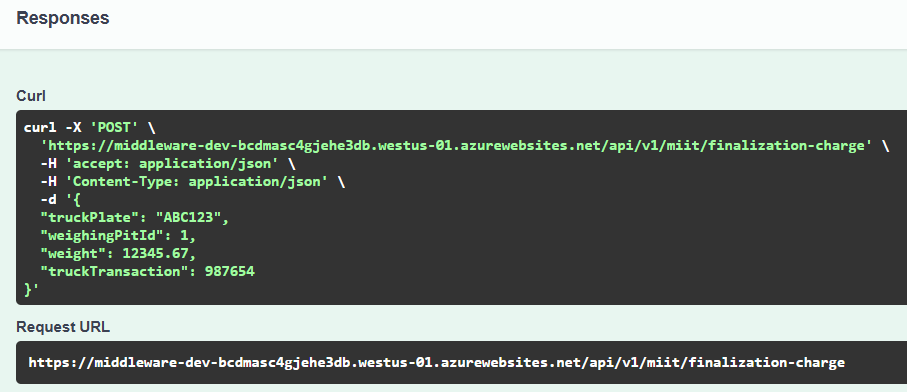

<style>
/* Justificar el texto en los encabezados */
h2, h3 {
    text-align: justify;
}

/* Justificar el texto en los párrafos */
p {
    text-align: justify;
}

img {
    display: block;
    margin: 0 auto;  /* Centra la imagen */
    width: 80%;  /* Ajusta el tamaño al 80% del contenedor */
    max-width: 600px;  /* Establece un ancho máximo para la imagen */
  }

  /* Estilo general para todas las tablas */
table {
    width: 100%;  /* Las tablas ocuparán todo el ancho del contenedor */
    border-collapse: collapse;  /* Colapsa los bordes para que no haya espacio entre celdas */
    table-layout: fixed;  /* Establece que todas las celdas tengan el mismo ancho */
}

/* Estilo para las celdas de la tabla */
th, td {
    padding: 8px;
    text-align: left;
    border: 1px solid #ddd;  /* Bordes suaves alrededor de cada celda */
    overflow: hidden;  /* Para evitar que el texto se desborde de las celdas */
    word-wrap: break-word;  /* Hace que el texto largo se ajuste a la celda */
}
th, td {
    width: 20%;  /* Ajusta este porcentaje según el número de columnas */
}
</style>

# Functional Requirements Document

## 1. General Project Information


| Project Name                  | Interface Design in the Middleware for PBCU Applications Integration         |
|-------------------------------|------------------------------------------------------------------------------|
| Sprint                        | Sprint # 3                                                                   |
| Assigned Team                 | Team G                                                                       |
| Sprint Start Date             | 14 October of 2024                                                           |
| Delivery Date                 | 1 November of 2024                                                           |

## 2. Objective

The primary objective of the sprint is to develop and implement a Middleware system that efficiently and securely integrates the TOS (OTM) and Turbo Graneles (MIIT) systems. This integration ensures accurate consultation, processing, and transfer of key logistical data, including appointments, gate entries, load completions, and vehicle departures. The Middleware must guarantee a seamless, accurate, and real-time flow of information between both systems, enabling informed decision-making and optimization of logistical processes.

## 3. Sprint Scope

The scope of the sprint involves developing and implementing a Middleware system that integrates and facilitates data transfer between the TOS (OTM) and Turbo Graneles (MIIT) systems. The Middleware will enable the consultation and processing of information regarding appointments, gate entries, load completions, and vehicle departures, ensuring correct data transmission between the systems. This includes the implementation of APIs, data validation, error handling, secure transmission, and integration testing. The project does not cover modifications to the TOS (OTM) or Turbo Graneles (MIIT) systems, nor the development of graphical interfaces or integration with other systems.

## 4. Functional Requirements

### 4.1 General Description

- **RF-01**: Consultation of Appointments from TOS (OTM): The Middleware system must retrieve both scheduled and canceled appointments from the TOS (OTM).
- **RF-02**: Sending Appointments to Turbo Graneles (MIIT): The Middleware must transmit appointment information to the Turbo Graneles (MIIT) system according to the expected format.
- **RF-03**: Consultation of Gate Entry Information from TOS (OTM): The Middleware must retrieve gate entry information, including weights and scale numbers, from the TOS (OTM).
- **RF-04**: Sending Gate Entry Data to Turbo Graneles (MIIT): The Middleware must send gate entry information to Turbo Graneles (MIIT) for processing.
- **RF-05**: Receiving Load Completion Information from MIIT: The Middleware must receive load completion data from Turbo Graneles (MIIT).
- **RF-06**: Sending Load Completion Data to TOS (OTM): The Middleware must send load completion information to the TOS (OTM) for recording and processing.
- **RF-07**: Consultation of Vehicle Departure from TOS (OTM): The Middleware must retrieve vehicle departure information from the TOS (OTM).
- **RF-08**: Sending Vehicle Departure Data to Turbo Graneles (MIIT): The Middleware must send vehicle departure information to Turbo Graneles (MIIT) for recording.
- **RF-09**: Error Handling for Appointment Consultation: The Middleware must handle any errors that occur while retrieving appointments from TOS (OTM).
- **RF-10**: Error Handling for Sending Appointments to MIIT: The Middleware must handle any errors that occur when transmitting appointment data to Turbo Graneles (MIIT).
- **RF-11**: Validation of Gate Entry Data: The Middleware must validate the accuracy and consistency of gate entry data before sending it to MIIT.
- **RF-12**: Validation of Vehicle Departure Data: The Middleware must validate vehicle departure data before transmitting it to Turbo Graneles (MIIT).
- **RF-13**: Authentication for Access to TOS (OTM) API: The Middleware must correctly authenticate requests to the TOS (OTM) API.
- **RF-14**: Authentication for Access to Turbo Graneles (MIIT) API: The Middleware must correctly authenticate requests sent to the MIIT API.
- **RF-15**: Contingency Management for TOS (OTM) Consultation Failures: The Middleware must manage contingencies in case of consultation failures with TOS (OTM), including retry attempts or notifications.
- **RF-16**: Contingency Management for Sending Data to MIIT Failures: The Middleware must manage contingencies if data transmission to MIIT fails, including retry attempts or error logging.
- **RF-17**: Temporary Data Storage: The Middleware must temporarily store appointment, gate entry, and vehicle departure information if it cannot be processed in real time.
- **RF-18**: Sending Processing Confirmations: The Middleware must send confirmation responses to TOS (OTM) and Turbo Graneles (MIIT) after successfully processing the data.
- **RF-19**: Transaction Auditing: The Middleware must log all data consultation and transmission transactions for future audits and failure analysis.
- **RF-20**: Error and Status Report Generation: The Middleware must generate detailed reports on errors and transaction statuses for monitoring and analysis.

### 4.2 Use Cases

#### Use Case 1: Consult Appointments from TOS (OTM)
- **Actor:** Middleware
- **Preconditions:** The Middleware has access to the TOS (OTM) API.
- **Main Flow:**
  1. The Middleware sends a request to TOS (OTM) to retrieve appointment data.
  2. TOS (OTM) responds with the appointment information.
  3. The Middleware processes the received data.
- **Postconditions:** The Middleware stores the appointment data for further processing.

#### Use Case 2: Send Appointments to Turbo Graneles (MIIT)
- **Actor:** Middleware
- **Preconditions:** Appointment information is available.
- **Main Flow:**
  1. The Middleware retrieves the appointment data.
  2. The Middleware sends the appointment information to MIIT.
  3. Turbo Graneles (MIIT) receives and processes the data.
- **Postconditions:** The appointment information has been successfully sent to MIIT.

#### Use Case 3: Consult Gate Entry Information from TOS (OTM)
- **Actor:** Middleware
- **Preconditions:** The Middleware has access to the TOS (OTM) API.
- **Main Flow:**
  1. The Middleware sends a request to consult gate entry information.
  2. TOS (OTM) responds with the gate entry data.
  3. The Middleware processes and validates the received information.
- **Postconditions:** The Middleware has the gate entry information ready for further transmission.

#### Use Case 4: Send Gate Entry Information to Turbo Graneles (MIIT)
- **Actor:** Middleware
- **Preconditions:** Gate entry information is available.
- **Main Flow:**
  1. The Middleware retrieves the gate entry data.
  2. The Middleware sends the information to Turbo Graneles (MIIT).
  3. Turbo Graneles (MIIT) receives and processes the data.
- **Postconditions:** The gate entry information has been successfully sent to MIIT.

#### Use Case 5: Receive Load Completion Information from Turbo Graneles (MIIT)
- **Actor:** Middleware
- **Preconditions:** The Middleware has access to the MIIT API.
- **Main Flow:**
  1. The Middleware sends a request to MIIT.
  2. Turbo Graneles (MIIT) responds with the load completion information.
  3. The Middleware processes the received data.
- **Postconditions:** The load completion information has been successfully received and processed.

#### Use Case 6: Send Load Completion Information to TOS (OTM)
- **Actor:** Middleware
- **Preconditions:** Load completion information is available.
- **Main Flow:**
  1. The Middleware retrieves the load completion data.
  2. The Middleware sends the information to TOS (OTM).
  3. TOS (OTM) processes the received data.
- **Postconditions:** The load completion information has been successfully sent to TOS (OTM).

#### Use Case 7: Consult Vehicle Departure Information from TOS (OTM)
- **Actor:** Middleware
- **Preconditions:** The Middleware has access to the TOS (OTM) API.
- **Main Flow:**
  1. The Middleware sends a request to retrieve vehicle departure information.
  2. TOS (OTM) responds with the requested data.
  3. The Middleware processes the received response.
- **Postconditions:** The vehicle departure information has been successfully obtained.

#### Use Case 8: Send Vehicle Departure Information to Turbo Graneles (MIIT)
- **Actor:** Middleware
- **Preconditions:** Vehicle departure information is available.
- **Main Flow:**
  1. The Middleware retrieves the vehicle departure data.
  2. The Middleware sends the information to Turbo Graneles (MIIT).
  3. Turbo Graneles (MIIT) receives and processes the data.
- **Postconditions:** The vehicle departure information has been successfully sent to MIIT.

#### Use Case 9: Handle Errors When Consulting Appointments from TOS (OTM)
- **Actor:** Middleware
- **Preconditions:** The Middleware attempts to make a request.
- **Main Flow:**
  1. The Middleware sends a request for consultation.
  2. If an error occurs, the Middleware manages the contingency (retries, error logging).
- **Postconditions:** The Middleware handles the error properly and retries if necessary.

#### Use Case 10: Handle Errors When Sending Appointments to Turbo Graneles (MIIT)
- **Actor:** Middleware
- **Preconditions:** The Middleware attempts to send the information.
- **Main Flow:**
  1. The Middleware attempts to send the data.
  2. If an error occurs, the Middleware manages the contingency (retries, error logging).
- **Postconditions:** The Middleware handles the error properly and retries if necessary.

#### Use Case 11: Validate Gate Entry Data
- **Actor:** Middleware
- **Preconditions:** The Middleware has received the gate entry data.
- **Main Flow:**
  1. The Middleware verifies the validity of the data.
  2. If the data is valid, it is sent to MIIT.
  3. If the data is invalid, error messages are generated.
- **Postconditions:** The validated data is sent to MIIT or errors are notified.

#### Use Case 12: Validate Vehicle Departure Data
- **Actor:** Middleware
- **Preconditions:** The Middleware has received the vehicle departure data.
- **Main Flow:**
  1. The Middleware verifies the validity of the data.
  2. If the data is valid, it is sent to MIIT.
  3. If the data is invalid, error messages are generated.
- **Postconditions:** The validated data is sent to MIIT or errors are notified.

#### Use Case 13: Authenticate Requests to the TOS (OTM) API
- **Actor:** Middleware
- **Preconditions:** The Middleware sends a request to the API.
- **Main Flow:**
  1. The Middleware sends an authentication request.
  2. The TOS (OTM) API validates the credentials.
  3. The request is processed if authentication is successful.
- **Postconditions:** Authentication is successful, and the request is processed.

#### Use Case 14: Authenticate Requests to the Turbo Graneles (MIIT) API
- **Actor:** Middleware
- **Preconditions:** The Middleware sends a request to the API.
- **Main Flow:**
  1. The Middleware sends an authentication request.
  2. The MIIT API validates the credentials.
  3. The request is processed if authentication is successful.
- **Postconditions:** Authentication is successful, and the request is processed.

#### Use Case 15: Handle Contingencies in Case of TOS (OTM) Query Failures
- **Actor:** Middleware
- **Preconditions:** The Middleware makes a query.
- **Main Flow:**
  1. If the query fails, the Middleware attempts a retry.
  2. If the retry fails, the error is logged.
- **Postconditions:** The error is logged and properly managed.

#### Use Case 16: Handle Contingencies in Case of Failures When Sending to MIIT
- **Actor:** Middleware
- **Preconditions:** The Middleware makes a send request.
- **Main Flow:**
  1. If the send request fails, the Middleware attempts a retry.
  2. If the retry fails, the error is logged.
- **Postconditions:** The error is logged and properly managed.

#### Use Case 17: Temporarily Store Data
- **Actor:** Middleware
- **Preconditions:** Appointment, gate entry, or vehicle departure data is available.
- **Main Flow:**
  1. The Middleware temporarily stores the data for future queries or actions.
  2. The data is deleted when no longer needed.
- **Postconditions:** The data is temporarily stored or deleted when completed.

#### Use Case 18: Send Responses and Processing Confirmations
- **Actor:** Middleware
- **Description:** The Middleware sends confirmation responses after successfully processing the information.
- **Preconditions:** The Middleware has processed the information.
- **Main Flow:**
  1. The Middleware generates a confirmation response.
  2. The Middleware sends the confirmation to TOS (OTM) or MIIT.
- **Postconditions:** The confirmation has been successfully sent to the corresponding systems.

#### Use Case 19: Generate Transaction Audit Log
- **Actor:** Middleware
- **Description:** The Middleware generates a detailed log of all transactions for future audits.
- **Preconditions:** The transactions have been completed.
- **Main Flow:**
  1. The Middleware logs each transaction in a log file.
  2. The file is accessible for subsequent audits.
- **Postconditions:** The transactions are recorded, and the log file is accessible for auditing.

#### Use Case 20: Generate Error and Status Reports
- **Actor:** Middleware
- **Description:** The Middleware generates reports on errors and transaction statuses.
- **Preconditions:** The Middleware has processed a transaction.
- **Main Flow:**
  1. The Middleware creates a detailed report.
  2. The report is sent to the administrator or stored for review.
- **Postconditions:** The error or status report has been successfully generated and sent or stored.

## 5. Validations Requested by the Client

#### V-01: Validation of Appointments
- **Description:** Ensure that booked and canceled appointments are correctly processed and updated from TOS (OTM) before being sent to Turbo Graneles (MIIT).
- **Acceptance Criteria:**
  - Appointments must be correctly queried from TOS (OTM).
  - Canceled appointments must be identified and properly marked.
  - Appointment data must match the expected format for MIIT.

#### V-02: Validation of Gate Entry Information
- **Description:** Ensure that the gate entry information from TOS (OTM) is correctly queried and processed before being sent to Turbo Graneles (MIIT).
- **Acceptance Criteria:**
  - Gate entry data must be complete and accurate (gate number, received weight, scale number, etc.).
  - The Middleware must verify that the data format is correct before sending it to MIIT.

#### V-03: Validation of Completed Load Information
- **Description:** Ensure that the completed load information received from Turbo Graneles (MIIT) is complete and accurate before being processed in the TOS (OTM) system.
- **Acceptance Criteria:**
  - The completed load must be confirmed by MIIT.
  - The data should include details such as weight, vehicle identification, and any other relevant information.
  - The Middleware must verify the integrity and format of the data before sending it to TOS (OTM).

#### V-04: Validation of Vehicle Exit Information
- **Description:** Verify that the vehicle exit information retrieved from TOS (OTM) is correctly processed before being sent to Turbo Graneles (MIIT).
- **Acceptance Criteria:**
  - The vehicle exit data must include the vehicle number, exit time, and other relevant details.
  - The Middleware must ensure that the data is sent in the appropriate format to MIIT.

#### V-05: Data Integrity Validation
- **Description:** Validate that all data queried and sent between TOS (OTM) and Turbo Graneles (MIIT) is correct, complete, and unaltered.
- **Acceptance Criteria:**
  - The Middleware must perform a data integrity check both before and after each data transfer between the systems.
  - Any missing or incorrect data must be detected and reported for correction.

#### V-06: Authentication and Authorization Validation
- **Description:** Validate that all requests and responses between Middleware, TOS (OTM), and Turbo Graneles (MIIT) are properly authenticated.
- **Acceptance Criteria:**
  - All API requests must be authenticated using the appropriate authentication method.
  - The Middleware must ensure that only authorized users and services can perform queries and data submissions.

#### V-07: Retry Validation in Case of Failures
- **Description:** Validate that the Middleware implements an appropriate retry system in case of failures in data queries or submissions.
- **Acceptance Criteria:**
  - If a submission or query fails, the Middleware must perform up to 3 retries before logging the error.
  - The retry logic must ensure the system continues functioning even if some attempts fail.

#### V-08: Data Format Validation
- **Description:** Ensure that the data received and sent between the Middleware, TOS (OTM), and Turbo Graneles (MIIT) is in the proper format for processing.
- **Acceptance Criteria:**
  - The Middleware must validate that the format of the data sent and received complies with the specifications of each system (e.g., JSON, XML).
  - Any format discrepancies must be reported and handled appropriately.

#### V-09: API Response Time Validation
- **Description:** Validate that the requests to the APIs of TOS (OTM) and Turbo Graneles (MIIT) are completed within a reasonable time frame.
- **Acceptance Criteria:**
  - API responses must be received within a maximum of 10 seconds per request.
  - The Middleware must manage and report any requests that exceed this time.

#### V-10: Transaction Status Notification Validation
- **Description:** Validate that the status notifications for transactions, such as the success or failure of data submission, are generated and sent correctly.
- **Acceptance Criteria:**
  - The Middleware must generate clear notifications about the transaction status and send them to the corresponding systems.
  - Notifications must include relevant details, such as the error code and description in case of failures.

#### V-11: Audit Log Validation
- **Description:** Ensure that all transactions and errors are correctly logged for future audits.
- **Acceptance Criteria:**
  - The Middleware must log all interactions, including queries, submissions, and errors.
  - Logs must be accessible for future reviews and audits.

#### V-12: Vehicle Information Consistency Validation
- **Description:** Ensure that vehicle information, such as license plate number and weight, is consistent between TOS (OTM) and Turbo Graneles (MIIT).
- **Acceptance Criteria:**
  - The Middleware must verify that vehicle data is consistent before sending it to MIIT and vice versa.
  - Any inconsistency must be reported and corrected.

#### V-13: Error Handling Validation in Data Submission
- **Description:** Ensure that any error during the data submission process is identified, reported, and managed correctly.
- **Acceptance Criteria:**
  - The Middleware must implement an error handling system that detects and manages failures during data submission.
  - Errors must be reported with sufficient details for resolution.

#### V-14: Validation of API Error Responses
- **Description:** Validate that the Middleware appropriately handles error responses from the TOS (OTM) and Turbo Graneles (MIIT) APIs.
- **Acceptance Criteria:**
  - The Middleware must correctly interpret error codes and messages returned by the APIs.
  - The system must perform the appropriate actions in response to these errors.

#### V-15: Validation of API Version Compatibility
- **Description:** Validate that the versions of the TOS (OTM) and Turbo Graneles (MIIT) APIs are compatible with the version of the Middleware.
- **Acceptance Criteria:**
  - The Middleware must verify that the API versions are compatible before performing queries or data submissions.
  - Any incompatibility must be detected and notified to the client.

#### V-16: Validation of Data Processing Capacity
- **Description:** Ensure that the Middleware can handle large volumes of data without system failures or slowdowns.
- **Acceptance Criteria:**
  - The Middleware must be able to process large amounts of data without affecting system performance.
  - Processing times must remain within acceptable limits.

#### V-17: Validation of Historical Data Load
- **Description:** Verify that the Middleware can correctly handle and process historical data.
- **Acceptance Criteria:**
  - The Middleware must be able to query and process historical data for appointments, vehicles, and loads without errors.

#### V-18: Validation of Middleware Module Integration
- **Description:** Validate that all Middleware modules (queries, submissions, validations) function together seamlessly and without conflicts.
- **Acceptance Criteria:**
  - The Middleware must ensure that all modules work together without integration errors.

#### V-19: Validation of Compliance with Regulations and Standards
- **Description:** Ensure that the Middleware complies with applicable local and international regulations and standards.
- **Acceptance Criteria:**
  - The Middleware must comply with data security, privacy standards, and any other relevant industry regulations.

#### V-20: Validation of Service Availability
- **Description:** Ensure that the Middleware service is available for queries and submissions at all times, with high availability.
- **Acceptance Criteria:**
  - The Middleware must have an availability rate of 99.9% or higher, ensuring that the systems are always operational.

## 6. Assumptions and Dependencies

- Full and stable access to the TOS (OTM) and Turbo Graneles (MIIT) APIs is necessary for the integration between the systems. It is assumed that both services will be available throughout the integration process.

- A functional testing environment must be available during the development and testing phases to simulate all interactions and possible scenarios between Middleware, TOS (OTM), and MIIT.

- Detailed documentation of the TOS (OTM) and MIIT APIs is required to ensure correct integration. This should include specifications on endpoints, data formats, authentication methods, and possible error responses.

- Proper configuration in MIIT is necessary for the parameterized sending of weight reports. This is critical for ensuring that the weight data received from TOS (OTM) is processed correctly in MIIT.

## 7. Service Data

### 7.1 GetVoyageandVessel

**Request and Response**

```json
Request
{
   "voyage": "1234",
   "vesselName": "CMA-Test",
   "vesselVoyage": "CMA-Test1234",
   "eta": "2024-07-20-10:36.25",
   "etd": "2024-07-20-10:45.55"
}
```

```json
Response
{
   "statusResponse": "Ok",
   "code": 200,
   "description": "sucessfull"
}
```
### 7.2 GetLoadByEachVessel

**Request and Response**
```json
Request

{
   "voyage": "1234",
   "noBL": "SSF034576272",
   "customer": "Uniban",
   "product": "Banana",
   "weightBl ": "4550.22"
}
```
```json
Response
{
   "statusResponse": "Ok",
   "code": 200,
   "description": "sucessfull"
}

```
### 7.3 SendVesselStatus

**Request and Response**
```json
Request
{
   " voyage ": "DSFR-0007",
   " status ": "Arrived"
}
```
```json
Response
{
   "statusResponse": "Ok",
   "code": 200,
   "description": "sucessfull"
}
```
### 7.4 SendReceiptRecord
**Request and Response**
```json
Request
{
   "voyage": "1234",
   "idTransaction": "1234",
   "weighingPit": "05",
   "productId": "Avocado",
   "receiptWeight": "12000,50",
   "DateTimeEnd": "2024-07-20-10:45.55"

}
```
```json
Response
{
   "statusResponse": "Ok",
   "code": 200,
   "description": "sucessfull"
}
```
### 7.5	SendCustomsReleasedCargo
**Request and Response**
```json
Request

{
   "voyage": "1234",
   "status": "Release",
   " weightBl ": "52000",
   "noBL": "SSF034576272",
   "customer": "UNIBAN",
   "product": "Avocado",
}
```
```json
Response
{
   "statusResponse": "Ok",
   "code": 200,
   "description": "sucessfull"
}
```
### 7.6	GetAppointmentInformation

**Request and Response**
```json
Request
{
   "status": "created",
   "dateTimeStart": "2024-07-21 21:30",
   "dateTimeEnd": "2024-07-21 22:00",
   "transportId": "89520125689",
   "driverName": "Camilo Cárdenas",
   "driverId": "1234567",
   "truckPlate": "LJK178",
   "maxWeightPermitted": 50000,
   "noBL": "SSF034576272",
   "product": "Avocado",
   "voyage": "CMA-Test1234",
   "weightRequired": 35000,
   "destinationCode": 29
}
```
```json
Response
{
   "statusResponse": "Ok",
   "code": 200,
   "description": "sucessfull"
}
```
### 7.7	GetGateIN

**Request and Response**
```json
Request

{
   "truckPlate": "LJK178",
   "arriveDate": "2024-07-21",
   "arriveTime": "21:45:22",
   "arriveWeight": 1550.25,
   "truckTransaction": 555879,
   " weighingBridgeId ": "2"
}
```
```json
Response
{
   "statusResponse": "Ok",
   "code": 200,
   "description": "sucessfull"
}
```

### 7.8	SendTruckFinalizationLoading

**Request and Response**
```json
Request

{
   "truckPlate": "LJK178",
   "weighingPitId ": "04",
   "weight": 35000,
   "truckTransaction": 555879
}
```
```json
Response

{
   "statusResponse": "Ok",
   "code": 200,
   "description": "Sucessfull"
}
```
### 7.9	GetGateOut

**Request and Response**
```json
Request

{
   "departureDateTime": "2024-07-22 11:15:24",
   "truckPlate": "LJK178",
   "truckGrossWeight ": 15180.13,
   "cargoWeight": 2000,
   "truckTransaction": 98745,
   "weightBridgeId": 2
}
```
```json
Response
{
   "statusResponse": "Ok",
   "code": 200,
   "description": "Sucessfull"
}
```

## 8. Unit Tests
### 8.1 Check - Test

### 

### 

### 

### 8.2 Vessel Information
### 
### 
### 
### 

### 8.3 Get Detailed Information on the Load of Each Vessel
### 
### 
### 
### 

### 8.4 Send Finalization Charge from MIIT

### 
### 
### 
### 

### 8.5 Receives Appointment Information from TOS, Processes It, and Forwards It to MIIT

### 
### 
### 
### 

### 8.6 Receives Gate-in Information from TOS, Processes It, and Forwards It to MIIT

### 
### 
### 
### 

### 8.7 Sends the End Vessel Process Data to MIIT for Processing and Validation

### 
### 
### 
### 

### 8.8 Registers Product Details Received for Processing in MIIT

### 
### 
### 
### 

### 8.9 Payload Containing the Vehicle Departure Details

### 
### 
### 
### 

### 8.10 Sends Container Data to the Terminal Operating System (TOS)

### 
### 
### 
### 

### 8.11 Sends Cargo Release Information to MIIT

### 
### 
### 
### 

### 8.12 Processes a Request to Lock or Unlock a Cargo in the TOS System

### 
### 
### 
### 

### 8.13 Sends a Block or Unblock Order to the TOS System
### 
### 
### 
### 


## 9. Annexes

### 9.1 GetVoyageandVessel

#### Request

| No | Field         | Type    | Size/Format | Domain   |
|----|---------------|---------|-------------|----------|
| 1  | voyage        | String  | 30/Varchar  |          |
| 2  | vesselName    | String  | 30/Varchar  |          |
| 3  | vesselVoyage  | String  | 30/Varchar  |          |
| 4  | eta           | datetime| datetime    |          |
| 5  | etd           | datetime| datetime    |          |

#### Response

| No | Field          | Type    | Size/Format | Domain          |
|----|----------------|---------|-------------|-----------------|
| 1  | statusResponse | String  | 5           | True, false     |
| 2  | code           | number  | 3           |                 |
| 3  | description    | String  | 250         |                 |


## 9.2 GetLoadByEachVessel

#### Request

| No | Field       | Type   | Size/Format    | Domain                          |
|----|-------------|--------|----------------|---------------------------------|
| 1  | voyage      | Number | 16             |                                 |
| 2  | noBL        | String | 16             | BL number in the TOS            |
| 3  | customer    | String | 16             | Customer in the TOS             |
| 4  | product     | String | 16             |                                 |
| 5  | weightBl    | Numeric| (20,2)/decimal |                                 |

#### Response

| No | Field          | Type    | Size/Format | Domain          |
|----|----------------|---------|-------------|-----------------|
| 1  | statusResponse | String  | 5           | True, false     |
| 2  | code           | number  | 3           |                 |
| 3  | description    | String  | 250         |                 |


## 9.3 SendVesselStatus
#### Request

| No | Field     | Type    | Size/Format  | Domain                |
|----|-----------|---------|--------------|-----------------------|
| 1  | voyage    | String  | 10/Varchar   |                       |
| 3  | status    | String  | 30/Varchar   | Arrived, Completed     |

#### Response

| No | Field          | Type    | Size/Format | Domain          |
|----|----------------|---------|-------------|-----------------|
| 1  | statusResponse | String  | 5           | True, false     |
| 2  | code           | number  | 3           |                 |
| 3  | description    | String  | 250         |                 |


## 9.4 SendReceiptRecord

#### Request

| No | Field         | Type    | Size/Format   | Domain                  |
|----|---------------|---------|---------------|-------------------------|
| 1  | voyage        | String  | 30/Varchar    | Vessel visit from TOS    |
| 2  | idTransaction | String  | 10/Varchar    |                         |
| 3  | productId     | String  | 30/Varchar    |                         |
| 4  | receiptWeight | Numeric | (10,2)/decimal|                         |
| 5  | DateTimeEnd   | DateTime| 20            | 2024-07-20-11:00.00     |
| 6  | weighingPit   | String  | 10/Varchar    |                         |

#### Response

| No | Field          | Type    | Size/Format | Domain          |
|----|----------------|---------|-------------|-----------------|
| 1  | statusResponse | String  | 5           | True, false     |
| 2  | code           | number  | 3           |                 |
| 3  | description    | String  | 250         |                 |


## 9.5 SendCustomsReleasedCargo

#### Request

| No | Field       | Type    | Size/Format   | Domain                          |
|----|-------------|---------|---------------|---------------------------------|
| 1  | voyage      | String  | 30/Varchar    | Vessel visit from TOS           |
| 3  | noBl        | String  | 16            | BL number in the TOS            |
| 4  | customer    | String  | 16            | Customer                        |
| 5  | product     | String  | 30/Varchar    |                                 |
| 6  | weightBl    | Numeric | (10,2)/decimal|                                 |
| 7  | status      | String  |               | Release, Apply                   |

#### Response

| No | Field          | Type    | Size/Format | Domain          |
|----|----------------|---------|-------------|-----------------|
| 1  | statusResponse | String  | 5           | True, false     |
| 2  | code           | number  | 3           |                 |
| 3  | description    | String  | 250         |                 |


## 9.6 GetAppointmentInformation

#### Request

| No | Field           | Type    | Size/Format   | Domain                         |
|----|-----------------|---------|---------------|--------------------------------|
| 1  | status          | Numeric | int           | 1 appointment taken, 0 appointment cancelled |
| 2  | dateTimeStart   | datetime| Yyyy-MM-dd HH:mm:ss |                                |
| 3  | dateTimeEnd     | datetime| Yyyy-MM-dd HH:mm:ss |                                |
| 4  | transportid     | String  | 30/Varchar    |                                |
| 5  | driverId        | String  | 30/Varchar    |                                |
| 6  | driverName      | String  | 50/Varchar    |                                |
| 7  | truckPlate      | String  | 15/Varchar    |                                |
| 8  | maxWeightPermitted | Numeric |              |                                |
| 9  | noBl            | String  | 16/Varchar    | BL number in the TOS           |
| 10 | product         | String  | 30/Varchar    |                                |
| 11 | voyage          | String  | 30/Varchar    | Vessel voyage from TOS         |
| 12 | weightRequired  | Numeric |               |                                |
| 13 | destinationCode | Numeric |               |                                |

#### Response

| No | Field          | Type    | Size/Format | Domain          |
|----|----------------|---------|-------------|-----------------|
| 1  | statusResponse | String  | 5           | True, false     |
| 2  | code           | number  | 3           |                 |
| 3  | description    | String  | 250         |                 |


## 9.7 GetGateIN

#### Response

| No | Field           | Type    | Size/Format    | Domain                 |
|----|-----------------|---------|----------------|------------------------|
| 1  | truckPlate      | String  | 15/Varchar     |                        |
| 2  | arriveDateTime  | DateTime| Yyyy-MM-dd HH:mm:ss |                    |
| 3  | arriveWeight    | Numeric | (15,2)/decimal |                        |
| 4  | truckTransaction| Numeric | int            |                        |
| 5  | weighingBridgeId| Numeric | int            |                        |

#### Response

| No | Field          | Type    | Size/Format | Domain          |
|----|----------------|---------|-------------|-----------------|
| 1  | statusResponse | String  | 5           | True, false     |
| 2  | code           | number  | 3           |                 |
| 3  | description    | String  | 250         |                 |


## 9.8 SendTruckFinalizationLoading

#### Request

| No | Field           | Type    | Size/Format    | Domain                        |
|----|-----------------|---------|----------------|-------------------------------|
| 1  | truckPlate      | String  | 15/Varchar     |                               |
| 2  | weighingPit     | Numeric | (15,2)/decimal |                               |
| 3  | weight          | Numeric |                |                               |
| 4  | truckTransaction| Numeric | int            |                               |

#### Response

| No | Field          | Type    | Size/Format | Domain          |
|----|----------------|---------|-------------|-----------------|
| 1  | statusResponse | String  | 5           | True, false     |
| 2  | code           | number  | 3           |                 |
| 3  | description    | String  | 250         |                 |


## 9.9 GetGateOut

#### Request

| No | Field           | Type    | Size/Format    | Domain                        |
|----|-----------------|---------|----------------|-------------------------------|
| 1  | departureDateTime | String | 15/Varchar    |                               |
| 2  | truckPlate      | String  | 15/Varchar     |                               |
| 3  | truckTransaction| Numeric | (10,2)/decimal |                               |
| 4  | transactionType | String  |                |                               |

#### Response

| No | Field          | Type    | Size/Format | Domain          |
|----|----------------|---------|-------------|-----------------|
| 1  | statusResponse | String  | 5           | True, false     |
| 2  | code           | number  | 3           |                 |
| 3  | description    | String  | 250         |                 |

