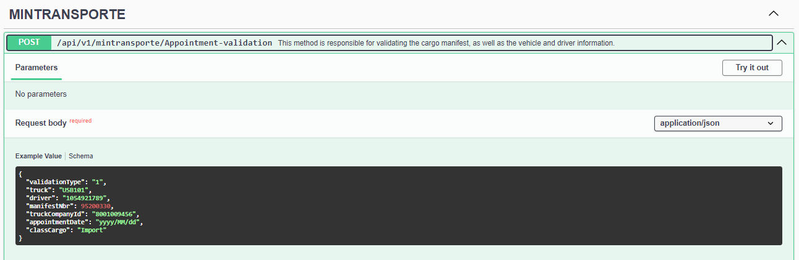
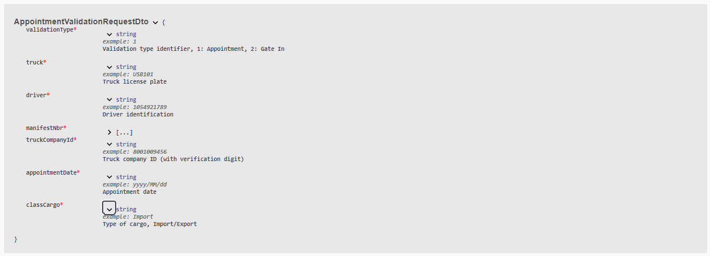
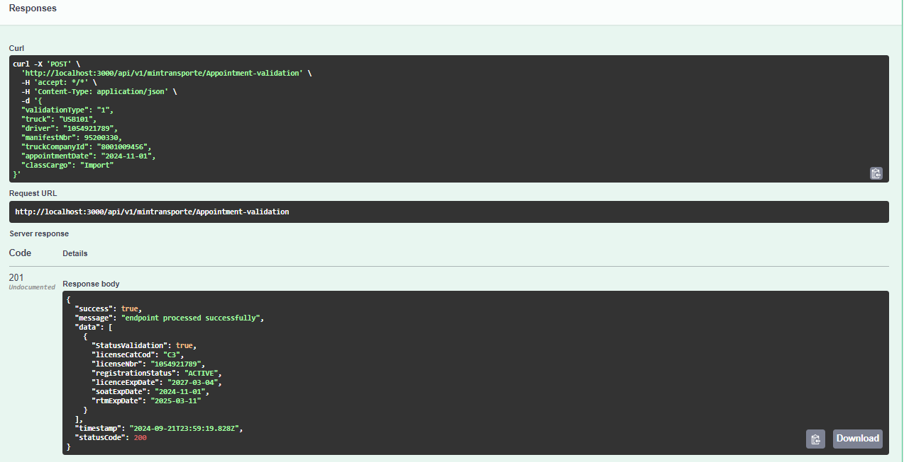
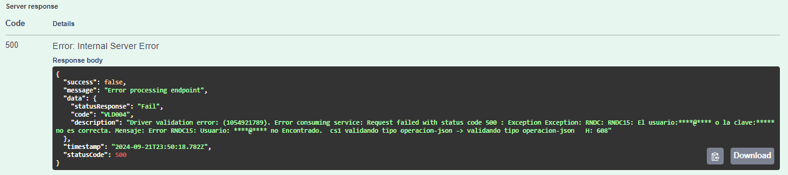
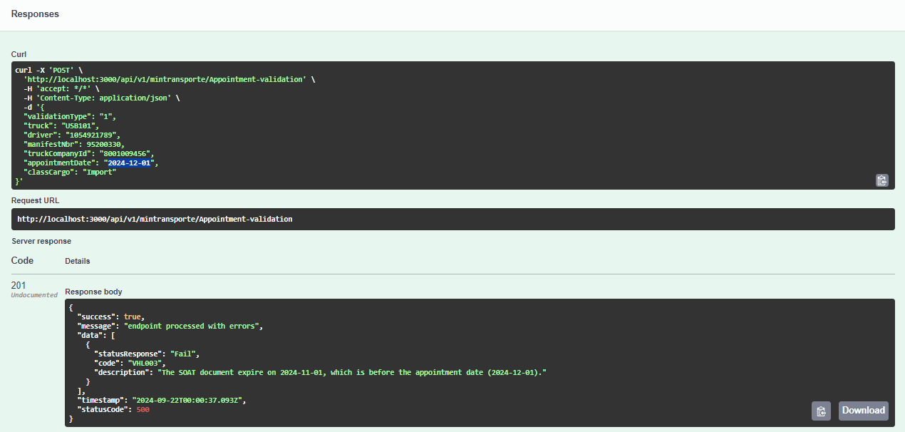
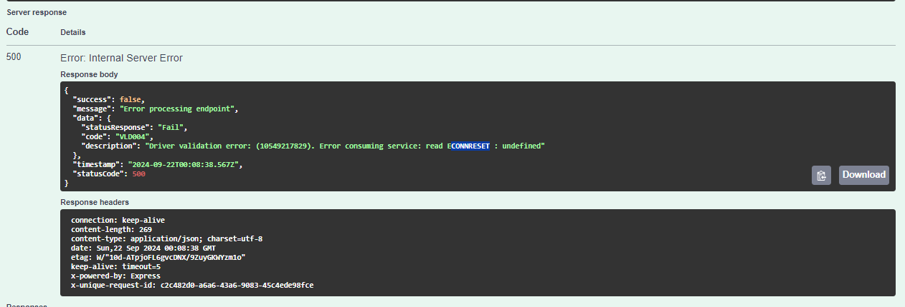

<style>
/* Justificar el texto en los encabezados */
h2, h3 {
    text-align: justify;
}

/* Justificar el texto en los párrafos */
p {
    text-align: justify;
}

img {
    display: block;
    margin: 0 auto;  /* Centra la imagen */
    width: 80%;  /* Ajusta el tamaño al 80% del contenedor */
    max-width: 600px;  /* Establece un ancho máximo para la imagen */
  }

  /* Estilo general para todas las tablas */
table {
    width: 100%;  /* Las tablas ocuparán todo el ancho del contenedor */
    border-collapse: collapse;  /* Colapsa los bordes para que no haya espacio entre celdas */
    table-layout: fixed;  /* Establece que todas las celdas tengan el mismo ancho */
}

/* Estilo para las celdas de la tabla */
th, td {
    padding: 8px;
    text-align: left;
    border: 1px solid #ddd;  /* Bordes suaves alrededor de cada celda */
    overflow: hidden;  /* Para evitar que el texto se desborde de las celdas */
    word-wrap: break-word;  /* Hace que el texto largo se ajuste a la celda */
}
th, td {
    width: 20%;  /* Ajusta este porcentaje según el número de columnas */
}
</style>

# Functional Requirements Delivery

## 1. General Project Information

| Project Name                  | Interface Design in the Middleware for PBCU Applications Integration         |
|-------------------------------|------------------------------------------------------------------------------|
| Sprint                        | Sprint # 1                                                                   |
| Assigned Team                 | Team G                                                                       |
| Sprint Start Date             | 16 September of 2024                                                         |
| Delivery Date                 | 20 September of  2024                                                        |

## 2. Objective

Develop a set of Middleware services to validate vehicle, driver, and manifest data with the Ministry of Transport, consolidating responses and notifying the TOS (OTM) if entry is permitted or if there are any issues, as well as performing the necessary validations for the "appointment validation" service.

## 3. Sprint Scope

The scope includes the validation of vehicle, driver, and manifest data, integrating with the Ministry of Transport to verify the validity of licenses, license plates, SOAT (Mandatory Insurance), and technical-mechanical inspections (RTM), as well as the authenticity and status of the manifests. These validations are consolidated and returned to the TOS (OTM) system or the "appointment validation" service, ensuring that the provided data meets the necessary requirements for entry into the logistics system.

## 4. Functional Requirements

### 4.1. General Description

**Ministry of Transport - Appointment Validation**

  - **RF-01**: The Middleware must receive the request with the vehicle, driver, and manifest data from the TOS (OTM).
  - **RF-02**: The Middleware must execute the validation services for the driver, vehicle, and manifest.
  - **RF-03**: The Middleware must consolidate the validation responses.
  - **RF-04**: If all validations are correct, the Middleware must notify the TOS (OTM) that entry is permitted.
  - **RF-05**: If any validation fails, the Middleware must notify the TOS (OTM) with the corresponding issue.
  - **RF-06**: The Middleware must take the driver's ID and perform the validation with the Ministry of Transport.
  - **RF-07**: Verify that the driver's license is of type C2 or C3 and that it is not expired.
  - **RF-08**: Return the response with the license validation to the "appointment validation" service.
  - **RF-09**: The Middleware must validate the vehicle's license plate with the Ministry of Transport.
  - **RF-10**: Verify that the registration, SOAT (Mandatory Insurance), and technical-mechanical inspection (RTM) of the vehicle are not expired.
  - **RF-11**: Retornar la respuesta con la validación del vehículo al servicio “validación de citas”.
  - **RF-12**: The Middleware must validate the manifest with the Ministry of Transport.
  - **RF-13**: Verify that the license plate and the driver's document match the information in the manifest.
  - **RF-14**: Validate the active status of the manifest and the Import and Export movements according to the PBCU code.
  - **RF-15**: If the value of the manifest exceeds 500,000,001, the validation must be inhibited.
  - **RF-16**: Return the response with the manifest validation to the "appointment validation" service.

### 4.2. Use Cases

#### Use Case 1: Validate Appointments
- **Actor:** TOS (OTM)
- **Preconditions:** The Middleware receives the appointment data from the TOS (OTM) system.
- **Main Flow:**
  1. The Middleware takes the appointment data.
  2. It validates that all required data (driver, vehicle, manifest) is present.
  3. The validations for each related entity (driver, vehicle, manifest) are executed.
  4. The response is returned to the TOS (OTM) system with the appointment validation.
- **Postconditions:** The appointment is either successfully validated or an issue is reported.

#### Use Case 2: Validate Driver
- **Actor:** Middleware
- **Preconditions:** The Middleware receives a driver's ID from the TOS (OTM).
- **Main Flow:**
  1. The Middleware takes the driver's ID.
  2. The Middleware validates the driver's license with the Ministry of Transport.
  3. The Middleware verifies that the license is of type C2 or C3 and that it is not expired.
  4. The Middleware returns the validation to the TOS (OTM).
- **Postconditions:** The validation of the driver's license is completed successfully.

#### Use Case 3: Validate Vehicle
- **Actor:** Middleware
- **Preconditions:** The Middleware receives a vehicle's license plate from the TOS (OTM).
- **Main Flow:**
  1. The Middleware validates the vehicle's registration with the Ministry of Transport.
  2. The Middleware verifies that the registration, SOAT, and RTM are valid.
  3. The Middleware returns the validation to the TOS (OTM).
- **Postconditions:** The vehicle validation is completed successfully.

#### Use Case 4: Validate Manifest
- **Actor:** Middleware
- **Preconditions:** The Middleware receives a manifest from the TOS (OTM).
- **Main Flow:**
  1. The Middleware captures and validates the manifest with the Ministry of Transport.
  2. The Middleware verifies the match between the license plate and the driver's document.
  3. The Middleware checks the active status of the manifest and its movement.
  4. The Middleware inhibits the validation if the value of the manifest exceeds 500,000,001.
  5. The Middleware returns the validation to the TOS (OTM).
- **Postconditions:** The manifest validation is completed successfully.

## 5. Client-Requested Validations

#### V-01: Appointment Validation
- **Description:** The system must validate the appointment data, ensuring that all necessary information has been provided and that the validations for the driver, vehicle, and manifest are successful.
- **Acceptance Criteria:**
  - The required appointment data must be present.
  - All associated validations (driver, vehicle, manifest) must be successful.
  - The response must be sent correctly to the TOS (OTM) system.

#### V-02: Validación de Datos del Conductor
- **Description:** Validar la cédula y licencia del conductor.
- **Acceptance Criteria:**
  - The license must be of type C2 or C3 and not expired.

#### V-03: Validación del Vehículo
- **Description:** Validar la placa del vehículo y verificar la matrícula, SOAT y RTM.
- **Acceptance Criteria:**
  - The registration must be valid, and both the SOAT and the RTM must not be expired.

#### V-04: Validación del Manifiesto
- **Description:** Verify the existence of the manifest, the match between the license plate and the driver's document, and that the manifest is active.
- **Acceptance Criteria:**
  - The manifest must be active.
- The received license plate must match the plate on the manifest.
- The driver's document must match one of the documents registered on the manifest.
- For Import movements, the origin must match the PBCU code.
- For Export movements, the destination must match the PBCU code.
- If the value of the manifest exceeds 500,000,001, the validation is inhibited.

### 5.1.	Error Handling
- All errors must be logged in a logging system for auditing.
- The system must have an error handling and notification mechanism in case of validation failures.

## 6. Assumptions and Dependencies

- It is assumed that the Middleware has access to the services of the Ministry of Transport.
- The system depends on the availability and stability of the external services provided by the Ministry of Transport.
- The TOS (OTM) must provide the correct data in the appropriate format for validation.

## 7. Service Data

### Documentation Swagger - Ambiente DEV

**URL**: [Swagger DEV](https://middleware-dev-bcdmasc4gjehe3db.westus-01.azurewebsites.net/api-docs#/)

### Input Parameters
```json
{
  "validationType": "1",
  "truck": "USB101",
  "driver": "1054921789",
  "manifestNbr": 95200330,
  "truckCompanyId": "8001009456",
  "appointmentDate": "2024-12-01",
  "classCargo": "Import"
}
```
### Service Response

#### Successful Result
```json
{
  "success": true,
  "message": "endpoint processed successfully",
  "timestamp": "2024-09-19T21:28:04:961Z",
  "statusCode": 200,
  "data": [
    {
      "StatusValidation": true,
      "licenseCatCod": "C3",
      "licenseNbr": "1054921789",
      "registrationStatus": "ACTIVE",
      "licenceExpDate": "2027-03-04",
      "soatExpDate": "2024-11-01",
      "rtmExpDate": "2025-03-11"
    }
  ],
  "timestamp": "2024-09-22T00:03:13.694Z",
  "statusCode": 200
}
```
#### Result with Errors
```json
{
  "success": true,
  "message": "endpoint processed with errors",
  "data": [
    {
      "statusResponse": "Fail",
      "code": "VLD001",
      "description": "Driver validation error: 10549217829, The license Not found."
    },
    {
      "statusResponse": "Fail",
      "code": "VHL001",
      "description": "Vehicle validation error, Vehicle Not found."
    },
    {
      "statusResponse": "Fail",
      "code": "VMF003",
      "description": "The driver 1054921789 is not associated with the cargo manifest: 95200330"
    }
  ],
  "timestamp": "2024-09-22T00:03:56.833Z",
  "statusCode": 500
}

{
  "success": false,
  "message": "Error processing endpoint",
  "data": {
    "statusResponse": "Fail",
    "code": "VLD004",
    "description": "Driver validation error: (10549217829). Error consuming service: read ECONNRESET"
  },
  "timestamp": "2024-09-22T00:08:38.567Z",
  "statusCode": 500
}
```
### Screenshot Swagger

#### Request Body:

### 
### 


## 8. Unit Tests
### Escenario Ok: 
### Manejo de Errores: 
### 
### 

## 9. Annexes

#### Requests

| No. | Field            | Type   | Size/Format  | Domain               |
|-----|-------------------|--------|--------------|----------------------|
| 1   | validationType    | String | 1            | 1: Appointment, 2: Gate In |
| 2   | truck            | String | 6            |                      |
| 3   | driver           | String | 15           |                      |
| 4   | manifestNbr      | Number | 20           |                      |
| 5   | truckCompanyId   | String | 20           |                      |
| 6   | appointmentDate  | Date   | yyyy/mm/dd   |                      |
| 7   | classCargo       | String | 5            | Import, Export       |

#### Responses

| No. | Field               | Type      | Size/Format        | Domain               |
|-----|----------------------|-----------|---------------------|----------------------|
| 1   | success             | boolean   |                    | True                 |
| 2   | message             | String    | 40                 |                      |
| 3   | timestamp           | Date      | yyyy/mm/dd HH:mm:ss |                      |
| 4   | StatusCode          | number    | 3                  |                      |
| 5   | data                | String    | 5000               |                      |
| 6   | StatusValidation    | Boolean   |                    | True, False          |
| 7   | licenseCatCod       | String    | 3                  |                      |
| 8   | licenseNbr          | String    | 20                 |                      |
| 9   | registrationStatus  | String    | 20                 |                      |
| 10  | licenceExpDate      | Date      | yyyy/mm/dd         |                      |
| 11  | soatExpDate         | Date      | yyyy/mm/dd         |                      |
| 12  | rtmExpDate          | Date      | yyyy/mm/dd         |                      |

#### Error

| No. | Field                 | Type      | Size/Format         | Domain         |
|-----|------------------------|-----------|----------------------|----------------|
| 1   | success               | boolean   |                     | True           |
| 2   | message               | String    | 40                  |                |
| 3   | timestamp             | Date      | yyyy/mm/dd HH:mm:ss |                |
| 4   | StatusCode            | number    | 3                   |                |
| 5   | data                  | String    | 5000                |                |
| 6   | statusResponse        | String    | 5                   | Fail           |
| 7   | exception_code        | String    |                      |                |
| 8   | exception_description | string    | 5000                |                |

#### Exception Codes

#### Driver Validation

| Código  | Descripción                                                                 |
|---------|-----------------------------------------------------------------------------|
| VLD001  | Driver validation error: ${driverId}, The license Not found.               |
| VLD002  | Driver validation error: ${driverId}, The license has expired: (${driver.FECHAVENCIMIENTOLICENCIA}) |
| VLD003  | Driver validation error: ${driverId}. The license category does not start with C |

#### Vehicle Validation

| Código  | Descripción                                                                 |
|---------|-----------------------------------------------------------------------------|
| VHL001  | Vehicle validation error, Vehicle Not found.                               |
| VHL002  | The vehicle registration is invalid. The status reported to MinTransporte is: ${truck.ESTADOMATRICULA} |
| VHL003  | The SOAT document expire on ${truck.FECHAVENCE_SOAT}, which is before the appointment date (${appointmentDate.toISOString().slice(0, 10)}). |

#### Manifest Validation

| Código | Descripción                                                                                                                                                                        |
|--------|------------------------------------------------------------------------------------------------------------------------------------------------------------------------------------|
| VMF001 | The cargo manifest query with ID `${dataAppointment.manifestNbr}` and truck company `${dataAppointment.truckCompanyId}` did not return any information.                          |
| VMF002 | The cargo manifest is in a state different from 'AC'. The status reported by MinTransporte is: `${manifest.ESTADO}`                                                              |
| VMF003 | The driver `${manifest.NUMIDCONDUCTOR}` is not associated with the cargo manifest: `${dataAppointment.manifestNbr}`                                                              |
| VMF004 | For import movements, the origin must be '05837000'. The origin recorded in the cargo manifest is: `${manifest.ORIGEN}`                                                          |
| VMF005 | For export movements, the destination must be '05837000'. The destination recorded in the cargo manifest is: `$manifest.DESTINO}`                                               |


