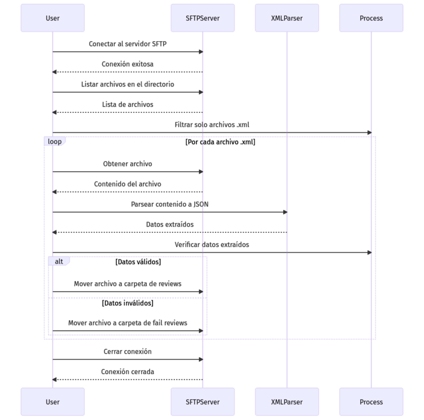

<style>
/* Justificar el texto en los encabezados */
h2, h3 {
    text-align: justify;
}

/* Justificar el texto en los párrafos */
p {
    text-align: justify;
}

img {
    display: block;
    margin: 0 auto;  /* Centra la imagen */
    width: 80%;  /* Ajusta el tamaño al 80% del contenedor */
    max-width: 600px;  /* Establece un ancho máximo para la imagen */
  }
  /* Estilo general para todas las tablas */
table {
    width: 100%;  /* Las tablas ocuparán todo el ancho del contenedor */
    border-collapse: collapse;  /* Colapsa los bordes para que no haya espacio entre celdas */
    table-layout: fixed;  /* Establece que todas las celdas tengan el mismo ancho */
}

/* Estilo para las celdas de la tabla */
th, td {
    padding: 8px;
    text-align: left;
    border: 1px solid #ddd;  /* Bordes suaves alrededor de cada celda */
    overflow: hidden;  /* Para evitar que el texto se desborde de las celdas */
    word-wrap: break-word;  /* Hace que el texto largo se ajuste a la celda */
}
th, td {
    width: 20%;  /* Ajusta este porcentaje según el número de columnas */
}

/* Estilo para las tablas en pantallas pequeñas */
@media (max-width: 768px) {
    table {
        display: block;  /* Convierte la tabla en un bloque deslizante */
        overflow-x: auto;  /* Permite que la tabla se deslice horizontalmente */
        white-space: nowrap;  /* Evita que el texto se ajuste */
    }
}
</style>

# Functional Requirements Document

## 1. General Project Information

| Project Name                  | Interface Design in the Middleware for PBCU Applications Integration         |
|-------------------------------|------------------------------------------------------------------------------|
| Sprint                        | Sprint # 4                                                                   |
| Assigned Team                 | Team J                                                                       |
| Sprint Start Date             | 1 November of 2024                                                           |
| Delivery Date                 | 15 November of 2024                                                          |

## 2. Objective

Integrate the Middleware with the Scanner system and the TOS (OTM) system to manage the vehicle scan confirmation, allowing the retrieval and sending of this information to release the container blockage.

## 3. Sprint Scope

The scope of the Sprint includes the integration of the Middleware with the Scanner system and the TOS (OTM). This integration will allow the capture of vehicle scan information, extract the license plate from the XML file, and send the confirmation to TOS for the release of associated blockages. The scope does not include modifications to the Scanner hardware or the TOS system, focusing solely on the integration and management of captured information.

## 4. Functional Requirements
### 4.1 General Description

- **RF-01:** The Middleware must obtain the vehicle passage confirmation from the Scanner system by retrieving the XML file from an FTP server.
- **RF-02:** The Middleware must extract the license plate from the XML file (field `licensePlate`).
- **RF-03:** The Middleware must validate that the received information is complete before continuing with the processing.
- **RF-04:** The Middleware must handle connection or processing errors of the XML file and report these failures to the source system.
- **RF-05:** The Middleware must send the scan confirmation to the TOS (OTM) system for the release of the container blockage.
- **RF-06:** The Middleware must validate that the data sent to TOS is complete and error-free.
- **RF-07:** The Middleware must manage sending errors and retry in case of failures, reporting unresolved errors.

### 4.2 Use Cases

#### Use Case 1: Reception and Processing of Scanner Confirmation

- **Actor:** Middleware, Scanner (LPR Camera)
- **Preconditions:** The Scanner is operational and generating XML files with vehicle information.
- **Main Flow:**
  1. The Middleware retrieves the XML file generated by the Scanner from the FTP server.
  2. The Middleware extracts the license plate (`licensePlate`) and validates that the information is complete.
  3. The Middleware temporarily stores the scan confirmation.
- **Postconditions:** The license plate information is correctly stored and ready for transmission to the TOS.

#### Use Case 2: Sending Scan Confirmation to TOS

- **Actor:** Middleware, TOS (OTM)
- **Preconditions:** The Middleware has received and validated the scan information.
- **Main Flow:**
  1. The Middleware sends the scan confirmation (license plate and other details) to the TOS system.
- **Postconditions:** The TOS receives and processes the information to release the container blockage.

#### Use Case 3: Handling Communication Errors

- **Actor:** Middleware, TOS (OTM)
- **Preconditions:** The Middleware attempts to send the scan information to the TOS.
- **Main Flow:**
  1. The Middleware detects an error when sending the data to the TOS.
  2. The Middleware retries the operation a configurable number of times.
  3. If the error persists, the Middleware reports the failure to the source system.
- **Postconditions:** Errors are handled and reported correctly for review.

## 5. Validations Requested by the Client

#### V-01: Vehicle License Plate Validation
- **Description:** The Middleware must validate that the license plate captured from the XML file follows the correct format.
- **Acceptance Criteria:**
  - The license plate must consist of 6 alphanumeric characters, following the format defined by current legislation (e.g., 3 letters followed by 3 numbers).
  - The Middleware must reject any license plate that does not comply with this format.

#### V-02: Complete XML File Validation
- **Description:** The Middleware must verify that the XML file received from the Scanner system contains all the necessary information to be processed correctly.
- **Acceptance Criteria:**
  - The file must contain the `licensePlate` field with the vehicle's plate number.
  - The file must include required information, such as the date and time of the scan.
  - The Middleware must reject any XML file that does not comply with the expected structure.

#### V-03: Data Completeness Validation for Sending to TOS
- **Description:** The Middleware must verify that all the necessary data for sending to the TOS (OTM) system is complete and correct.
- **Acceptance Criteria:**
  - Data such as the vehicle license plate, container details, and the date must be present in the message.
  - If any of this data is missing, the Middleware will not send the confirmation to the TOS and will generate an error message.

#### V-04: FTP Server Connection Validation
- **Description:** The Middleware must verify that the connection to the Scanner's FTP server is active before attempting to download the XML file.
- **Acceptance Criteria:**
  - The Middleware must attempt to establish a connection to the FTP server.
  - If the connection cannot be established, the Middleware must generate an error and notify the source system.

#### V-05: TOS Response Validation
- **Description:** The Middleware must validate the response from the TOS system to ensure that the container's lock has been correctly released.
- **Acceptance Criteria:**
  - The TOS must confirm that it has received and processed the scan confirmation correctly.
  - In case of an error, the Middleware must log the error and retry the process based on the configuration.

#### V-06: Error Handling in the Sending Process
- **Description:** The Middleware must handle errors in sending data to the TOS, retrying the sending process if necessary.
- **Acceptance Criteria:**
  - If the confirmation sending fails, the Middleware must attempt to resend it up to a configurable maximum number of retries.
  - If the resend attempts fail after the defined number of retries, an error should be reported and logged.

#### V-07: Validation of Data Format when Sending to the TOS
- **Description:** The Middleware must verify that the data sent to the TOS follows the required format.
- **Acceptance Criteria:**
  - The data must be sent in the required XML/JSON format or the format specified by the TOS system.
  - If the data does not follow the required format, the Middleware must generate an error and not send the data to the TOS.

## 6. Assumptions and Dependencies

- The FTP server of the Scanner is available and correctly configured for file access and transfer.
- The TOS service is operational and prepared to receive scanning information.
- The test environment for the TOS and Scanner systems must be configured and accessible for integration testing.
- Access to the documentation of the Scanner system and TOS (OTM) to verify connection details and format requirements.

## 7. Sequence

### 

## 8. Service Data

```json
Request
{
   "containerNumber": "MMAU1234567",
   "truckPlate": "UYT987",
   "dateTimeScan": "2024-07-21 21:45:22"
}

```
```json
Response
{
   "statusResponse": "Ok",
   "code": 200,
   "description": "sucessfull"
}

```

## 9. Unit Tests

### 9.1 Test Environment Configuration
### 

### 9.2 Service and Mock Initialization
### 

### 9.3 processAllFiles Tests

#### 9.3.1 Successfully Process Files
### 
### 

#### 9.3.2 Missing Data Handling
### 

#### 9.3.3 SFTP Connection Error
### 

#### 9.3.4 Error Listing Files
### 

### 9.4 uploadFile Tests

#### 9.4.1 Successful Upload
### 

#### 9.4.2 File Already Exists
### 

#### 9.4.3 Upload Error
### 


## 10. Annexes

#### Request

| No. | Field          | Type     | Size/Format           | Domain |
| --- | -------------- | -------- | --------------------- | ------ |
| 1   | containerNumber | String   | 15/Varchar           |        |
| 2   | truckPlate     | String   | 10/Varchar           |        |
| 3   | dateTimeScan   | Datetime | yyyy-MM-dd HH:mm:ss   |        |

#### Response

| No. | Field          | Type    | Size/Format | Domain          |
| --- | -------------- | ------- | ----------- | --------------- |
| 1   | statusResponse | String  | 5           | True, false     |
| 2   | code           | Number  | 2           |                 |
| 3   | description    | String  | 250         |                 |
