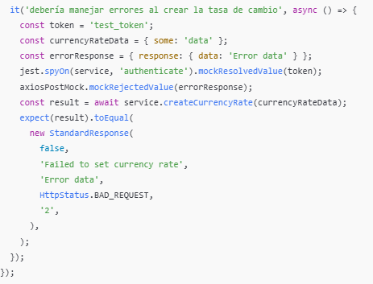

<style>
/* Justificar el texto en los encabezados */
h2, h3 {
    text-align: justify;
}

/* Justificar el texto en los párrafos */
p {
    text-align: justify;
}

img {
    display: block;
    margin: 0 auto;  /* Centra la imagen */
    width: 80%;  /* Ajusta el tamaño al 80% del contenedor */
    max-width: 600px;  /* Establece un ancho máximo para la imagen */
  }

  /* Estilo general para todas las tablas */
table {
    width: 100%;  /* Las tablas ocuparán todo el ancho del contenedor */
    border-collapse: collapse;  /* Colapsa los bordes para que no haya espacio entre celdas */
    table-layout: fixed;  /* Establece que todas las celdas tengan el mismo ancho */
}

/* Estilo para las celdas de la tabla */
th, td {
    padding: 8px;
    text-align: left;
    border: 1px solid #ddd;  /* Bordes suaves alrededor de cada celda */
    overflow: hidden;  /* Para evitar que el texto se desborde de las celdas */
    word-wrap: break-word;  /* Hace que el texto largo se ajuste a la celda */
}
th, td {
    width: 20%;  /* Ajusta este porcentaje según el número de columnas */
}
</style>

# Functional Requirements Document

## 1. General Project Information
| Project Name                  | Interface Design in the Middleware for PBCU Applications Integration         |
|-------------------------------|------------------------------------------------------------------------------|
| Sprint                        | Sprint # 3                                                                   |
| Assigned Team                 | Team J                                                                       |
| Sprint Start Date             | 14 October of 2024                                                           |
| Delivery Date                 | 01 November of 2024                                                          |

## 2. Objective

Automate the query of the Representative Market Rate (Tasa Representativa del Mercado, TRM) from the Financial Superintendence so that internal systems (ERP and TOS) receive the rate for the following day without manual intervention.

## 3. Sprint Scope

The scope of the sprint covers the implementation of a scheduled task in the Middleware for the automatic query and update of the Representative Market Rate (Tasa Representativa del Mercado, TRM) from the service provided by the Financial Superintendence. This process will run at configurable intervals within a specific time window, between 4:00 PM and 9:00 PM, ensuring that the TRM for the following day is available for subsequent use.

It includes the validation of the correct retrieval of the TRM and the transmission of this information to the TOS and ERP (IFS) systems, ensuring its proper integration and processing in both systems. The scope also includes the management of automatic notifications in case of failures during the query, with the possibility of sending email alerts to designated personnel to ensure a manual update of the TRM if the automatic query fails.

## 4. Functional Requirements

### 4.1 General Description

  - **RF-01:** Implement a scheduled task to query the TRM from the Financial Superintendence between 4:00 PM and 9:00 PM.
  - **RF-02:** Configure the system to send email notifications to the responsible parties if no successful response is received before 9:00 PM.
  - **RF-03:** Send the obtained TRM to the internal ERP and TOS systems, validating the integrity and completeness of the data.

### 4.2 Use Cases

#### Use Case 1: Automatic TRM Query from the Superintendence
- **Actor:** Middleware (MDW)
- **Preconditions:** Middleware has access to the documentation and credentials necessary to query the TRM from the Superintendence service.
- **Main Flow:**
  1. The Middleware initiates the scheduled task within the configured hours between 4:00 PM and 9:00 PM.
  2. A request is sent to the Superintendence service to obtain the TRM for the following day.
  3. The response from the Superintendence is checked to ensure it is successful.
  4. If the query is successful, the TRM is stored in the system for future use.
  5. If the query fails, the Middleware will continue attempting at configured intervals until 9:00 PM.
- **Postconditions:** The TRM for the following day has been successfully queried and stored in the system for use in other processes.

#### Use Case 2: Sending TRM to TOS
- **Actor:** Middleware (MDW)
- **Preconditions:** The TRM has been successfully queried and stored in the system.
- **Main Flow:**
  1. The Middleware starts the process of sending the TRM to the TOS system.
  2. It validates that the TRM data is complete and free from errors.
  3. The TRM is sent to the TOS system through a secure connection.
  4. The transaction and the status of the sending process are logged in the Middleware system.
- **Postconditions:** The TRM is successfully sent and processed in the TOS system, and the transaction status is logged.

#### Use Case 3: Sending TRM to ERP (IFS)
- **Actor:** Middleware (MDW)
- **Preconditions:** The TRM has been successfully queried and stored in the system.
- **Main Flow:**
  1. The Middleware starts the process of sending the TRM to the ERP (IFS) system.
  2. It validates that the TRM data is complete and free from errors.
  3. The TRM is sent to the ERP (IFS) system through a secure connection.
  4. The transaction and the status of the sending process are logged in the Middleware system.
- **Postconditions:** The TRM is successfully sent and processed in the ERP (IFS) system, and the transaction status is logged.

## 5. Validations Requested by the Client

#### V-01: Validation of Automatic TRM Query from the Financial Superintendence
- **Description:** Ensure that the Middleware correctly queries the TRM from the Financial Superintendence service within the configured time frame and specified interval.
- **Acceptance Criteria:**
  - The scheduled task must execute between 16:00 and 21:00 hours.
  - The Middleware must successfully send a request to the Financial Superintendence service to retrieve the TRM for the next day.
  - If the query is successful, the TRM must be correctly stored.
  - If the query fails, retry attempts must be made until 21:00 hours.

#### V-02: Validation of TRM Sending to TOS
- **Description:** Ensure that the Middleware sends the TRM correctly to the TOS system.
- **Acceptance Criteria:**
  - The TRM data must be validated before sending to the TOS to ensure it is complete and error-free.
  - The TRM must be sent to the TOS via a secure connection.
  - The transaction and the status of the send must be correctly recorded in the Middleware system.

#### V-03: Validation of TRM Sending to ERP (IFS)
- **Description:** Ensure that the Middleware sends the TRM correctly to the ERP (IFS) system.
- **Acceptance Criteria:**
  - The TRM data must be validated before sending to the ERP (IFS) to ensure it is complete and error-free.
  - The TRM must be sent to the ERP (IFS) via a secure connection.
  - The transaction and the status of the send must be correctly recorded in the Middleware system.

## 6. Assumptions and Dependencies

- The Superintendencia Financiera will provide stable access and documentation for the TRM query service.
- The responsible individuals for receiving notifications in case of failure will be properly configured in the Middleware system.
- Access to the integration documentation with the Superintendencia Financiera will be available for querying the TRM.
- Access to the technical documentation of the TOS and ERP (IFS) systems will be available to validate the integration and TRM sending   process.

## 7. Diagrams

### 

## 8. Service Data

### Request and Response


```json
Request
{
   "trmValue": 4035.28,
   "validityFrom": "2024-07-17T00:00:00-05:00",
   "validityTo": "2024-07-17T00:00:00-05:00"
}
```
```json
Response
{
   "statusResponse": "Ok",
   "code": 200,
   "trmValue": 4035.28,
   "validityFrom": "2024-07-17T00:00:00-05:00",
   "validityTo": "2024-07-17T00:00:00-05:00",
   "description": "sucessfull"
}
```

### 9. Unit Tests
### 9.1 Module Import and Initial Setup
### 

### 9.2 Test Environment Configuration
### 

### 9.3 Method-Based Tests

#### 9.3.1 getHealth
This test verifies that the service responds correctly when performing a health check:
### 

#### 9.3.2 authenticate
- **Test for successfully obtaining an authentication token:** Simulates a valid response from `axios.post`.
- **Test for handling authentication errors:** Simulates an exception when calling `axios.post`.
### 

#### 9.3.3 createCurrencyRate
- **Test for successfully creating an exchange rate:** Validates the correct call to the service using `axios`.
- **Test for handling errors when creating an exchange rate:** Simulates an error and verifies handling of the failed response.
### 
### 

#### 9.3.4 updateCurrencyRate
Similar to the previous tests but focused on updating exchange rates.

#### 9.3.5 getTrmToday
Simulates retrieving SOAP data and handling errors:
### 

### 10. Annexes

#### Request

| No. | Field        | Type     | Size/Format      | Domain   |
|-----|--------------|----------|------------------|----------|
| 1   | trmValue     | Numeric  | (10,2)/decimal   |          |
| 2   | validityFrom | DateTime |                  |          |
| 3   | validityTo   | DateTime |                  |          |

#### Responses


| No. | Field           | Type   | Size/Format | Domain      |
|-----|------------------|--------|-------------|-------------|
| 1   | statusResponse   | String | 5           | Ok, Fail    |
| 2   | code            | Number | 2           |             |
| 3   | description     | String | 5000        |             |

